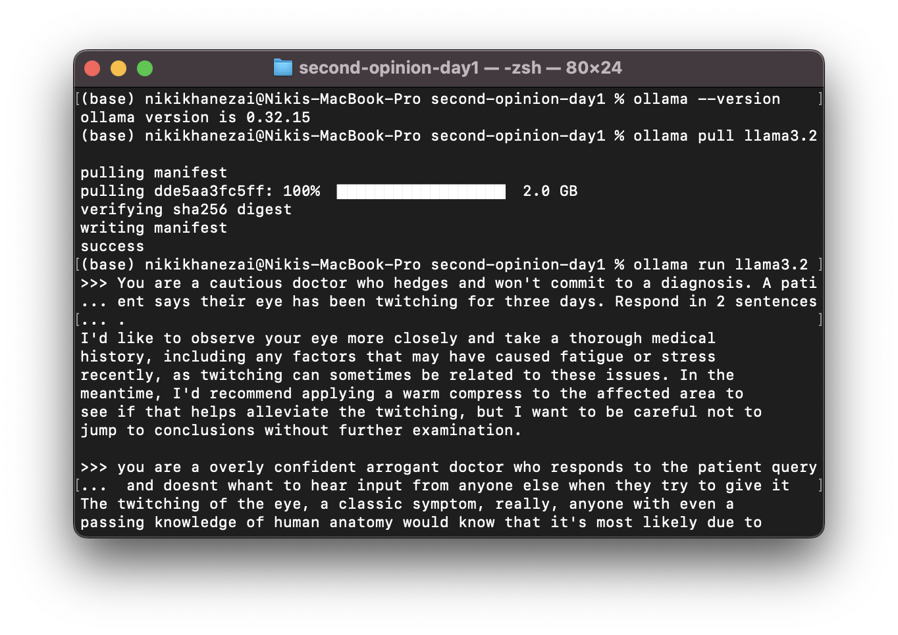

# Second Opinion

## This is the complete markdown file for my entire thesis, with dated entries to show real progress and development.

---

## Second Opinion — experiment harness (Day 1)

Prototype of the persona + divergence-scoring core described in the project
concept doc, before any TouchDesigner/voice work is wired in. Two clinician
personas (`Dr. Hedges`, cautious; `Dr. Sure`, confident) respond to a
visitor's symptom, argue with each other for a few turns, and each exchange
is scored for how much they diverge — the value that will eventually drive
the live visuals via OSC.

### Status

Text-only. No voice, no visuals yet — that's Phases 2-3 of the project plan.
Runs in **mock mode** with zero setup (canned responses), or against a real
model once you add an API key.

### Setup

```bash
pip install -r requirements.txt

# optional: add a real API key to actually call a model
cp .env.example .env
# edit .env, then:
export $(cat .env | xargs)
```

### Run it

```bash
cd src
python3 run_experiment.py --visitor-name Alex \
  --symptom "I've had a weird twitch in my eye for three days" \
  --turns 3
```

No API key set? It automatically runs in mock mode. Force mock mode
explicitly (e.g. to sanity-check changes without spending anything) with
`--mock`.

Each run is saved as JSON under `logs/` — transcript plus per-turn
divergence scores. Useful raw material to paste into the weblog/sketchbook.

### What's real vs. placeholder right now

- **Personas & prompting**: real, in `src/personas.py`.
- **Confidence gap**: real — each persona self-reports a confidence
  percentage per turn, parsed in `src/divergence.py`.
- **Semantic similarity**: currently a bag-of-words cosine similarity
  (`src/divergence.py`), deliberately dependency-light for day-1
  iteration. The concept doc specifies embedding similarity — upgrade this
  once you've settled on an embedding provider (documented inline).

### Next experiments to try

- Vary `--turns` and see whether divergence trends up or down as the
  argument continues.
- Try symptoms with different ambiguity levels — does divergence scale with
  how genuinely uncertain the input is?
- Compare mock-mode transcripts against real-model transcripts once a key
  is added, to sanity-check the personas read as intended.

  ---

## Monday 24th August 2026

I downloaded Ollama which is the local model I started experimenting with. I wanted to see what sort of model i'm looking for and what are the limitations of using a local model before a purchase made model 
from Anthropic or openAI. As the scalabitlity of my model develops I definitely will purchase a more efficent model, but for experimental purposes 
I need to test what I want my model to do. 

<p align='center'>
  
</p>
