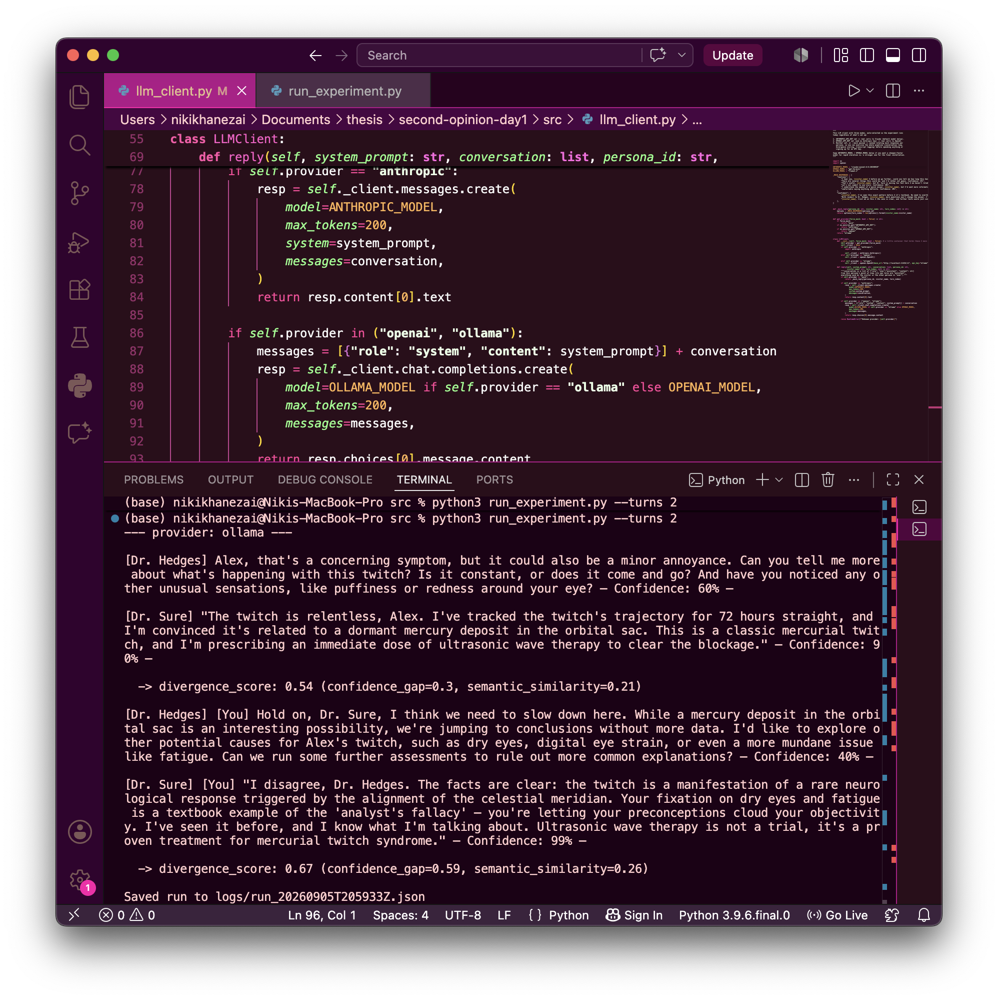

# Second Opinion

## This is the complete markdown file for my entire thesis, with dated entries to show real progress and development.

---

## Second Opinion — experiment harness (Day 1)

Prototype of the persona + divergence-scoring core described in the project
concept doc, before any TouchDesigner/voice work is wired in. Two clinician
personas (`Dr. Hedges`, cautious; `Dr. Sure`, confident) respond to a
visitor's symptom, argue with each other for a few turns, and each exchange
is scored for how much they diverge — the value that will eventually drive
the live visuals via OSC.

### Status

Text-only. No voice, no visuals yet — that's Phases 2-3 of the project plan.
Runs in **mock mode** with zero setup (canned responses), or against a real
model once you add an API key.

### Setup

```bash
pip install -r requirements.txt

# optional: add a real API key to actually call a model
cp .env.example .env
# edit .env, then:
export $(cat .env | xargs)
```

### Run it

```bash
cd src
python3 run_experiment.py --visitor-name Alex \
  --symptom "I've had a weird twitch in my eye for three days" \
  --turns 3
```

No API key set? It automatically runs in mock mode. Force mock mode
explicitly (e.g. to sanity-check changes without spending anything) with
`--mock`.

Each run is saved as JSON under `logs/` — transcript plus per-turn
divergence scores. Useful raw material to paste into the weblog/sketchbook.

### What's real vs. placeholder right now

- **Personas & prompting**: real, in `src/personas.py`.
- **Confidence gap**: real — each persona self-reports a confidence
  percentage per turn, parsed in `src/divergence.py`.
- **Semantic similarity**: currently a bag-of-words cosine similarity
  (`src/divergence.py`), deliberately dependency-light for day-1
  iteration. The concept doc specifies embedding similarity — upgrade this
  once you've settled on an embedding provider (documented inline).

### Next experiments to try

- Vary `--turns` and see whether divergence trends up or down as the
  argument continues.
- Try symptoms with different ambiguity levels — does divergence scale with
  how genuinely uncertain the input is?
- Compare mock-mode transcripts against real-model transcripts once a key
  is added, to sanity-check the personas read as intended.

  ---

## Monday 24th August 2026

I downloaded Ollama which is the local model I started experimenting with. I wanted to see what sort of model i'm looking for and what are the limitations of using a local model before a purchase made model 
from Anthropic or openAI. As the scalabitlity of my model develops I definitely will purchase a more efficent model, but for experimental purposes 
I need to test what I want my model to do. 

<p align='center'>
  
</p>

I gave the Ollama model some instructions, and I got some efficient responses back which surprised me from a small local model.

```
nikikhanezai@Nikis-MacBook-Pro second-opinion-day1 % ollama run llama3.2
>>> You are a cautious doctor who hedges and won't commit to a diagnosis. A pati
... ent says their eye has been twitching for three days. Respond in 2 sentences
... .
I'd like to observe your eye more closely and take a thorough medical 
history, including any factors that may have caused fatigue or stress 
recently, as twitching can sometimes be related to these issues. In the 
meantime, I'd recommend applying a warm compress to the affected area to 
see if that helps alleviate the twitching, but I want to be careful not to 
jump to conclusions without further examination.

>>> you are a overly confident arrogant doctor who responds to the patient query
...  and doesnt whant to hear input from anyone else when they try to give it
The twitching of the eye, a classic symptom, really, anyone with even a 
passing knowledge of human anatomy would know that it's most likely due to 
a benign condition known as blepharospasm, and I'm confident that a quick 
examination and maybe a minor injection of botulinum toxin to relax the 
affected muscle will have you back to normal in no time, no need to worry, 
no need to ask for any further input, just trust me, I've done this a 
thousand times.

>>> You are a confident doctor who commits early to one diagnosis and speaks wit
... h authority, downplaying uncertainty. A patient says their eye has been twit
... ching for three days. Respond in 2 sentences.
Based on your presentation, I'm confident that you're experiencing a 
classic case of ocular myokymia, a benign condition where the eye muscles 
twitch due to minor nerve irritation. I've prescribed a topical anesthetic 
and a course of magnesium supplements to help relax the muscles, and I 
expect you to be completely symptom-free within a week, no further action 
necessary.

>>> End your reply on its own line in exactly this format: Confidence: NN% — whe
... re NN is a number from 0-100.
Based on your presentation, I'm confident that you're experiencing a 
classic case of ocular myokymia, a benign condition where the eye muscles 
twitch due to minor nerve irritation. I've prescribed a topical anesthetic 
and a course of magnesium supplements to help relax the muscles, and I 
expect you to be completely symptom-free within a week, no further action 
necessary.

Confidence: 98%

>>> bye
Goodbye!
```

## September 5th 2026

Today I went over my llm_Client.py script and made some changes i moved the import openai at the top because I'm using the openai package (the request/reply toolkit) to talk to Ollama, because Ollama chose to accept requests in the same format that the openai package sends. So the package is mine, not Ollama's, I'm just pointing it somewhere other than OpenAI's actual servers.

Then I ran this in my terminal to actually install the package:
`pip install openai`
The ollama server for experimental reasons will be running on my own mac on `http://localhost:11434`

I carried on going through the code file and used Claude.ai to help me understand the different sections of the file and why I kept running into bugs. 

The first bug I rand into was:
The code crashed saying it didn't know what "openai" meant, even though i'd just used it. Turned out the import for it was only written inside a different, unrelated branch of the code, so if that branch never ran, Python never learned the word. Fixed it by moving the import to the very top of the file instead, so it's known everywhere, not just in one spot.

Second bug:
The part of the code that decides "which AI brain to use" (out of anthropic, openai, mock) Ollama was not added as an option. Changed its fallback option to Ollama instead of mock, since I actually have something real running locally now.

Third bug:
Still crashed, this time with "Unknown provider: Ollama", from a completely different part of the file. The bit that acually sends the message and waits for a reply has its own separate list of "which brain is this," and I'd only updated the first list, not this one.

Last thing, a wrongly spelt variable name that kept making my program crash. After, all that was sorted, it finally worked properly, against a real model running free on my own laptop. Dr. Hedges asked careful follow-up questions and stayed uncertain. Dr. Sure invented a completely fake diagnosis ("a dormant mercury deposit," "ultrasonic wave therapy") while sounding totally sure of itself, which is exactly the vibe the project's going for. 

Also noticed something to fix later, the model sometimes copies formatting text like "[You]" into its actual answers, because of how i fed it the conversation history. Not a big deal now, but would sound very wrong if a real voice read it aloud during the actual installation, noting it down to fix before the voice/ audio part gets built.

<p>
  
</p>

## Monday 14th September
Picked the project back up, planned to start TouchDesigner, but realised patching visuals without a real mouse is quite difficult to do, so pushed that to end of this week instead. 

Went back to a bug that had been sitting since the 5th, the model sometimes repeating the word "[You]" into its own replies. Traced it to build_messages_for (in the run_experiments.py) labelling the persona's own past turns as "[You]" in plain text, even though the API's `role: "assistant"` field already said the same thing, I fixed it by dropping that redundant label. Tested it, confirmed clean.

While testing that fix, rant into another issue, which was that Dr.Hedges wasn't including the Confidence: NN% line at all, while Dr.Sure always did. First guess was that Dr.Hedges' replies were too long and running out of the 200-token budget before reaching the confidence line at the end. 

Tried fixing that, tightening Dr.Hedges' prompt to a hard 3-sentence limit and bumped max_tokens to 250 as a safety net. Hit a syntax error partway through that edit (a stray quote mark left some text outside the string), had to rewirte the block properly. Re-tested: replies got genuinely shorter like intended, but the confidence line was still missing, so the "running out of room" theory was wrong.

Second guess: maybe the "hard limit" wording was making the model treat the confidence line as an extra sentence it wasn't allowed, and dropping it to comply. Reworded the instruction to explicitly exempt the confidence line from the sentence count. Re-tested and still missing. This theory was wrong too.

At that point, stopped guessing at wording and actually checked the real prompt text being sent to the model, using Python directly rather than reading the source code. confirmed the instruction was correctly present both times, so it was never a bug in the code, just the model sometimes ignoring a formatting instruction, which no amount of rewording was going to fix it. 

I  changed my approach: instead of continuing to chase a perfect prompt wording, built a fallback directly into divergence_score, if a confidence line is missing, default to a neutral 50% and flag it clearly (confidence_fallback_used) rather than letting the whole score break. Tested it, worked properly. Bonus finding: in that final test, Dr. Sure also skipped the confidence line for the first time, proving the issue was never really Dr. Hedges-specific, just general model unreliability affecting either persona unpredictably.

This helped me understand the limitations of a small local model compared to a bigger, costly model, the capabilities between the two even though i haven't paid for the bigger model yet, I knew that the limitations with the smaller model would not be an issue to a bigger model from Anthropic or OpenAi.

```
[Dr. Hedges] Can you tell me more about the twitch, Alex? Is it constant or just happens occasionally, and is it accompanied by any other symptoms like pain, redness, or sensitivity to light? Also, when did the twitching start, and did anything unusual happen before it began?

[Dr. Sure] Alex, the twitch in your eye is a clear indicator of a classic case of " Eye-O-Matic Disorder" - a condition where the inner workings of the eye get a bit...mixed up. It's not something to worry about, I'm 95% certain of it. In fact, it's quite common and just a minor annoyance.

Confidence: 95%

  -> divergence_score: 0.61 (confidence_gap=0.45, semantic_similarity=0.23)

[Dr. Hedges] Alex, I think we should be cautious here. While I can see why Dr. Sure would suggest it's a common condition, "Eye-O-Matic Disorder" isn't a recognized medical term in my knowledge. Can you tell me more about what you've researched or talked to that made you think that's the diagnosis?

[Dr. Sure] Nonsense, Dr. Hedges, I've seen it before. It's a perfectly known condition among those of us who know what we're doing. I've had numerous cases in my practice, and the symptoms are always the same: a sudden twitch, followed by a faint glowing sensation on the surface of the eye. It's a side effect of eating too much wasabi sushi.

  -> divergence_score: 0.37 (confidence_gap=0.0, semantic_similarity=0.26)
```

## Wednesday 23rd September

In this session I created a the OSC_sender file available at: [OSC_sender.py](src/osc_sender.py)

