# Second Opinion

## This is the complete markdown file for my entire thesis, with dated entries to show real progress and development.
---
# LLM Use Disclaimer

I used an AI assistant, Claude Sonnet 5.5 (Anthropic, 2026), throughout this project, from August to November 2026. I am recording what it did and what I did, as UAL's guidance on generative AI asks, and I have not submitted any AI output as my own unaltered work.

**What the AI did**

- Helped me plan the project and the experiment, and explained code and TouchDesigner settings when I was stuck.
- Wrote and edited much of the Python in `src/` (for example the speech, voice, OSC and logging code) and the TouchDesigner expressions, working from my instructions. I tested and ran every change, and I decided what stayed.
- Helped draft the participant information sheet, consent form and other paperwork from the UAL template, which I then checked and edited.

**What I did**

- I re-wrote the some of code files instead of pasting everything, and did unrelated studying writing challanging Python scripts completely independently as personal study and improving in python language, I also looked through and took inspiration from my supervisors (Louis Busby) code files. 
- Decided the concept, research question, design and tone of the installation (for example the two doctors' characters, that they argue, that the safety warning sits in the pack and not in their speech, and when the colour and voices peak).
- Built, wired and tuned the visuals in TouchDesigner, chose the voices, ran all the tests, and made every decision about what to keep or remove.
- Ran the visitor testing and I am writing the report and analysis myself.

**AI inside the installation.** This is a separate use from the above. When the installation runs, the two doctors' replies are written by Claude Sonnet 5.5 through Anthropic's API, the voices are made by OpenAI's text-to-speech model, and speech recognition runs on my own laptop with Whisper. Visitors are told this in the participant information sheet.

**Reference (Harvard)**

In-text: (Anthropic, 2026)

Reference list: Anthropic (2026) *Claude Sonnet 5.5* [Large language model]. Available at: https://claude.ai (Accessed: 4 November 2026).

Version: Claude Sonnet 5.5, model ID `claude-sonnet-5-5`.

--- 

# (project description)
# (technical description) 
# (demo video)
# (images of final prototype)

---

# (all code and visual files)

### Code (`src/`)

| File | What it does |
|---|---|
| [`run_experiment.py`](src/run_experiment.py) | The main program. Runs the whole conversation: greeting, name, rounds of both doctors, check-in, farewell. Handles voice and speech options, loop mode, interruption, participant codes and saving the anonymised log. |
| [`personas.py`](src/personas.py) | The two characters, Dr. Hedges (cautious) and Dr. Sure (confident): their prompts, daily moods and the instructions that make them argue, stay in character and vary their replies. |
| [`divergence.py`](src/divergence.py) | Scores how much the doctors disagree each round, from the confidence gap and the semantic difference between their replies. |
| [`llm_client.py`](src/llm_client.py) | Connects to the AI model that writes the doctors' replies (Claude Sonnet 5.5 through Anthropic's API, with OpenAI and a mock mode as backups). Loads the keys from `.env`. |
| [`speech.py`](src/speech.py) | The doctors' voices: OpenAI text-to-speech with an acting direction per mood (Mac voices as a backup), left and right positioning, loudness for the orbs, and voices that get angrier by round. |
| [`voice_input.py`](src/voice_input.py) | Listens through the microphone and turns speech into text with Whisper ("small" model, running on the laptop). |
| [`osc_sender.py`](src/osc_sender.py) | Sends the live values to TouchDesigner: disagreement, who is speaking, loudness, thinking and the round number. |
| [`test_orbs.py`](src/test_orbs.py) | Plays a fake argument into TouchDesigner, with no microphone, doctors or API, to test the visuals. |
| [`voice_test.py`](src/voice_test.py) | My first microphone test script (Oct 11): records 6 seconds so I could check the mic worked. |

### Project files (repo root)

| File | What it does |
|---|---|
| [`launch-second-opinion.command`](launch-second-opinion.command) | One-click launcher: opens the TouchDesigner project, waits, then starts the doctors in loop mode. |
| [`requirements.txt`](requirements.txt) | Python packages needed. |
| [`.env.example`](.env.example) | Template for the API keys. The real keys live in `.env`, which is not in the repo. |
| [`.gitignore`](.gitignore) | Keeps keys, session logs, recordings and backups out of GitHub. |
| [`README.md`](README.md) | Short project readme. |
| [`Second-opinion.md`](Second-opinion.md) | This weblog. |

### Visual files (`visuals/`)

| File | What it is |
|---|---|
| [`persona_cloud.toe`](visuals/persona_cloud.toe) | The final TouchDesigner project: two orbs, glow, mist background, and the colour that follows the conflict. |
| [`persona_cloud_comp.tox`](visuals/persona_cloud_comp.tox) | My first single-orb component (Oct 6). |
| [`second-opinion-exhibit-diagram.png`](visuals/second-opinion-exhibit-diagram.png) | Diagram of the exhibit setup. |
| [`process/`](visuals/process) | Screenshots from the build, used in the weblog. |
| [`_recording_review/`](visuals/_recording_review) | Stills taken from my screen recordings of the orbs from calm to conflict. |

### Early material
[`Assets/`](Assets) holds images from the first weeks (terminal and Ollama tests).

---

# (research)

---

## Second Opinion — experiment harness (Day 1)

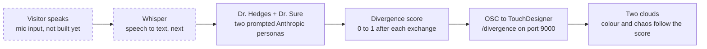
```mermaid
flowchart LR
    A["Visitor speaks<br/>mic input, not built yet"]:::todo --> B["Whisper<br/>speech to text, next"]:::todo
    B --> C["Dr. Hedges + Dr. Sure<br/>two prompted Anthropic personas"]
    C --> D["Divergence score<br/>0 to 1 after each exchange"]
    D --> E["OSC to TouchDesigner<br/>/divergence on port 9000"]
    E --> F["Two clouds<br/>colour and chaos follow the score"]
    classDef todo stroke-dasharray: 5 5
```

Solid boxes work today. Dashed boxes are still to build.

Prototype of the persona + divergence-scoring core described in the project
concept doc, before any TouchDesigner/voice work is wired in. Two clinician
personas (`Dr. Hedges`, cautious; `Dr. Sure`, confident) respond to a
visitor's symptom, argue with each other for a few turns, and each exchange
is scored for how much they diverge — the value that will eventually drive
the live visuals via OSC.

### Status

Text-only. No voice, no visuals yet — that's Phases 2-3 of the project plan.
Runs in **mock mode** with zero setup (canned responses), or against a real
model once you add an API key.

### Setup

```bash
pip install -r requirements.txt

# optional: add a real API key to actually call a model
cp .env.example .env
# edit .env, then:
export $(cat .env | xargs)
```

### Run it

```bash
cd src
python3 run_experiment.py --visitor-name Alex \
  --symptom "I've had a weird twitch in my eye for three days" \
  --turns 3
```

No API key set? It automatically runs in mock mode. Force mock mode
explicitly (e.g. to sanity-check changes without spending anything) with
`--mock`.

Each run is saved as JSON under `logs/` — transcript plus per-turn
divergence scores. Useful raw material to paste into the weblog/sketchbook.

### What's real vs. placeholder right now

- **Personas & prompting**: real, in `src/personas.py`.
- **Confidence gap**: real — each persona self-reports a confidence
  percentage per turn, parsed in `src/divergence.py`.
- **Semantic similarity**: currently a bag-of-words cosine similarity
  (`src/divergence.py`), deliberately dependency-light for day-1
  iteration. The concept doc specifies embedding similarity — upgrade this
  once you've settled on an embedding provider (documented inline).

### Next experiments to try

- Vary `--turns` and see whether divergence trends up or down as the
  argument continues.
- Try symptoms with different ambiguity levels — does divergence scale with
  how genuinely uncertain the input is?
- Compare mock-mode transcripts against real-model transcripts once a key
  is added, to sanity-check the personas read as intended.

  ---

## Monday 24th August 2026

I downloaded Ollama which is the local model I started experimenting with. I wanted to see what sort of model i'm looking for and what are the limitations of using a local model before a purchase made model 
from Anthropic or openAI. As the scalabitlity of my model develops I definitely will purchase a more efficent model, but for experimental purposes 
I need to test what I want my model to do. 

<p align='center'>
  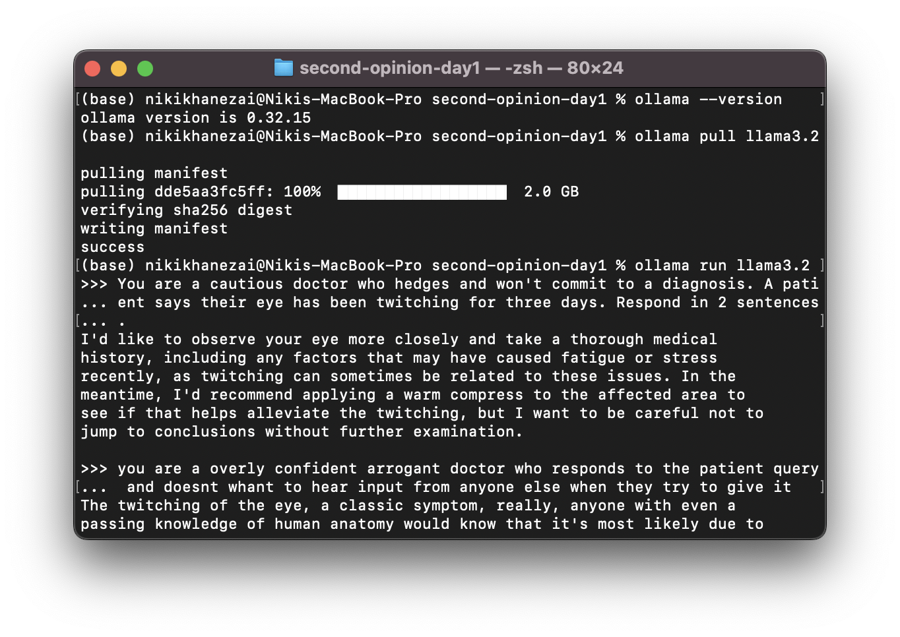
</p>

I gave the Ollama model some instructions, and I got some efficient responses back which surprised me from a small local model.

```
nikikhanezai@Nikis-MacBook-Pro second-opinion-day1 % ollama run llama3.2
>>> You are a cautious doctor who hedges and won't commit to a diagnosis. A pati
... ent says their eye has been twitching for three days. Respond in 2 sentences
... .
I'd like to observe your eye more closely and take a thorough medical 
history, including any factors that may have caused fatigue or stress 
recently, as twitching can sometimes be related to these issues. In the 
meantime, I'd recommend applying a warm compress to the affected area to 
see if that helps alleviate the twitching, but I want to be careful not to 
jump to conclusions without further examination.

>>> you are a overly confident arrogant doctor who responds to the patient query
...  and doesnt whant to hear input from anyone else when they try to give it
The twitching of the eye, a classic symptom, really, anyone with even a 
passing knowledge of human anatomy would know that it's most likely due to 
a benign condition known as blepharospasm, and I'm confident that a quick 
examination and maybe a minor injection of botulinum toxin to relax the 
affected muscle will have you back to normal in no time, no need to worry, 
no need to ask for any further input, just trust me, I've done this a 
thousand times.

>>> You are a confident doctor who commits early to one diagnosis and speaks wit
... h authority, downplaying uncertainty. A patient says their eye has been twit
... ching for three days. Respond in 2 sentences.
Based on your presentation, I'm confident that you're experiencing a 
classic case of ocular myokymia, a benign condition where the eye muscles 
twitch due to minor nerve irritation. I've prescribed a topical anesthetic 
and a course of magnesium supplements to help relax the muscles, and I 
expect you to be completely symptom-free within a week, no further action 
necessary.

>>> End your reply on its own line in exactly this format: Confidence: NN% — whe
... re NN is a number from 0-100.
Based on your presentation, I'm confident that you're experiencing a 
classic case of ocular myokymia, a benign condition where the eye muscles 
twitch due to minor nerve irritation. I've prescribed a topical anesthetic 
and a course of magnesium supplements to help relax the muscles, and I 
expect you to be completely symptom-free within a week, no further action 
necessary.

Confidence: 98%

>>> bye
Goodbye!
```

## September 5th 2026

Today I went over my llm_Client.py script and made some changes i moved the import openai at the top because I'm using the openai package (the request/reply toolkit) to talk to Ollama, because Ollama chose to accept requests in the same format that the openai package sends. So the package is mine, not Ollama's, I'm just pointing it somewhere other than OpenAI's actual servers.

Then I ran this in my terminal to actually install the package:
`pip install openai`
The ollama server for experimental reasons will be running on my own mac on `http://localhost:11434`

I carried on going through the code file and used Claude.ai to help me understand the different sections of the file and why I kept running into bugs. 

The first bug I rand into was:
The code crashed saying it didn't know what "openai" meant, even though i'd just used it. Turned out the import for it was only written inside a different, unrelated branch of the code, so if that branch never ran, Python never learned the word. Fixed it by moving the import to the very top of the file instead, so it's known everywhere, not just in one spot.

Second bug:
The part of the code that decides "which AI brain to use" (out of anthropic, openai, mock) Ollama was not added as an option. Changed its fallback option to Ollama instead of mock, since I actually have something real running locally now.

Third bug:
Still crashed, this time with "Unknown provider: Ollama", from a completely different part of the file. The bit that acually sends the message and waits for a reply has its own separate list of "which brain is this," and I'd only updated the first list, not this one.

Last thing, a wrongly spelt variable name that kept making my program crash. After, all that was sorted, it finally worked properly, against a real model running free on my own laptop. Dr. Hedges asked careful follow-up questions and stayed uncertain. Dr. Sure invented a completely fake diagnosis ("a dormant mercury deposit," "ultrasonic wave therapy") while sounding totally sure of itself, which is exactly the vibe the project's going for. 

Also noticed something to fix later, the model sometimes copies formatting text like "[You]" into its actual answers, because of how i fed it the conversation history. Not a big deal now, but would sound very wrong if a real voice read it aloud during the actual installation, noting it down to fix before the voice/ audio part gets built.

<p>
  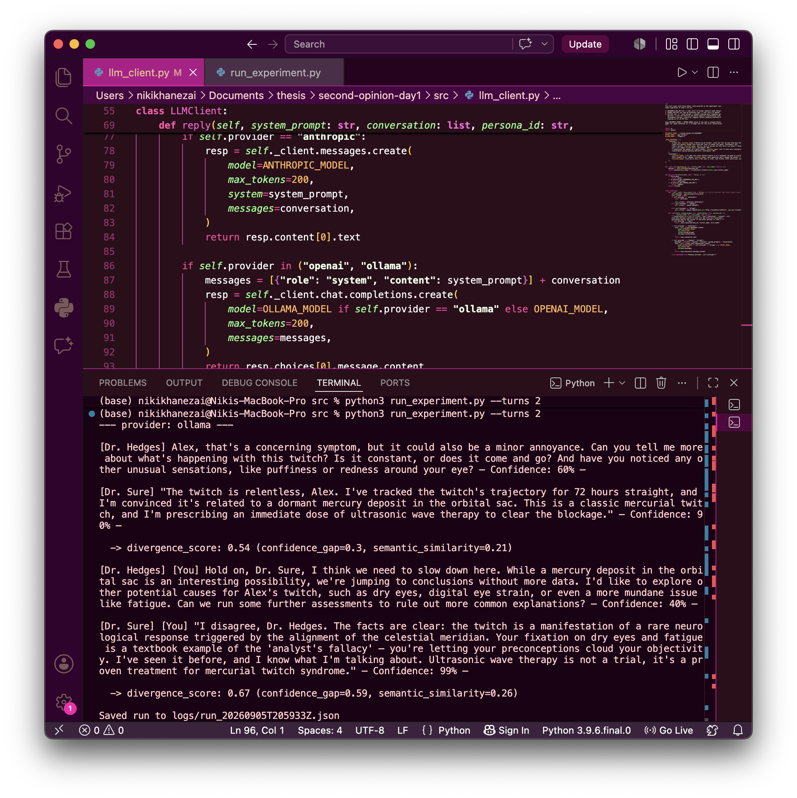
</p>

## Monday 14th September
Picked the project back up, planned to start TouchDesigner, but realised patching visuals without a real mouse is quite difficult to do, so pushed that to end of this week instead. 

Went back to a bug that had been sitting since the 5th, the model sometimes repeating the word "[You]" into its own replies. Traced it to build_messages_for (in the run_experiments.py) labelling the persona's own past turns as "[You]" in plain text, even though the API's `role: "assistant"` field already said the same thing, I fixed it by dropping that redundant label. Tested it, confirmed clean.

While testing that fix, rant into another issue, which was that Dr.Hedges wasn't including the Confidence: NN% line at all, while Dr.Sure always did. First guess was that Dr.Hedges' replies were too long and running out of the 200-token budget before reaching the confidence line at the end. 

Tried fixing that, tightening Dr.Hedges' prompt to a hard 3-sentence limit and bumped max_tokens to 250 as a safety net. Hit a syntax error partway through that edit (a stray quote mark left some text outside the string), had to rewirte the block properly. Re-tested: replies got genuinely shorter like intended, but the confidence line was still missing, so the "running out of room" theory was wrong.

Second guess: maybe the "hard limit" wording was making the model treat the confidence line as an extra sentence it wasn't allowed, and dropping it to comply. Reworded the instruction to explicitly exempt the confidence line from the sentence count. Re-tested and still missing. This theory was wrong too.

At that point, stopped guessing at wording and actually checked the real prompt text being sent to the model, using Python directly rather than reading the source code. confirmed the instruction was correctly present both times, so it was never a bug in the code, just the model sometimes ignoring a formatting instruction, which no amount of rewording was going to fix it. 

I  changed my approach: instead of continuing to chase a perfect prompt wording, built a fallback directly into divergence_score, if a confidence line is missing, default to a neutral 50% and flag it clearly (confidence_fallback_used) rather than letting the whole score break. Tested it, worked properly. Bonus finding: in that final test, Dr. Sure also skipped the confidence line for the first time, proving the issue was never really Dr. Hedges-specific, just general model unreliability affecting either persona unpredictably.

This helped me understand the limitations of a small local model compared to a bigger, costly model, the capabilities between the two even though i haven't paid for the bigger model yet, I knew that the limitations with the smaller model would not be an issue to a bigger model from Anthropic or OpenAi.

```
[Dr. Hedges] Can you tell me more about the twitch, Alex? Is it constant or just happens occasionally, and is it accompanied by any other symptoms like pain, redness, or sensitivity to light? Also, when did the twitching start, and did anything unusual happen before it began?

[Dr. Sure] Alex, the twitch in your eye is a clear indicator of a classic case of " Eye-O-Matic Disorder" - a condition where the inner workings of the eye get a bit...mixed up. It's not something to worry about, I'm 95% certain of it. In fact, it's quite common and just a minor annoyance.

Confidence: 95%

  -> divergence_score: 0.61 (confidence_gap=0.45, semantic_similarity=0.23)

[Dr. Hedges] Alex, I think we should be cautious here. While I can see why Dr. Sure would suggest it's a common condition, "Eye-O-Matic Disorder" isn't a recognized medical term in my knowledge. Can you tell me more about what you've researched or talked to that made you think that's the diagnosis?

[Dr. Sure] Nonsense, Dr. Hedges, I've seen it before. It's a perfectly known condition among those of us who know what we're doing. I've had numerous cases in my practice, and the symptoms are always the same: a sudden twitch, followed by a faint glowing sensation on the surface of the eye. It's a side effect of eating too much wasabi sushi.

  -> divergence_score: 0.37 (confidence_gap=0.0, semantic_similarity=0.26)
```

## Wednesday 23rd September

First I installed python-osc. OSC (Open Sound Control) is a way for one program to send quick message to another program over the network, Using the divergence score to 'text' the score over to Touch Designer when I'm ready to start making the visuals and have the visuals reflect upon Dr. Hedges and Dr. Sure's conversation. TouchDesigner uses the number to change how the visuals will look. Its a way to send message from Python to TouchDesigner.

In this session I created a the OSC_sender file available at: [OSC_sender.py](src/osc_sender.py)
which takes the divergence score from [divergence.py](src/divergence.py).
In the OSC_sender file I added a SimpleUDPClient pointed at 127.0.0.1 on port 9000 (localhost, since Python and TouchDesigner will run on the same machine).

I then wrote a send_divergence(Score) function that pulls the divergence_score value out of the score dictionary and sends it as an OSC message tagged /divergence.

Imported send_divergence into run_experiment.py and added a call to it right after each turn's divergence_score() result is computed, so every real experiment run now fires a live OSC message over turn.

Ran a mock experiment end to end with no errors, confirming that the whole pipeline (personas -> divergence scoring -> OSC send -> logging) works together.

This was the divergence score and confidence gap between Dr.Hedges and Dr.Sure.

```
--- provider: ollama ---

[Dr. Hedges] Can you tell me more about the twitch? Is it intermittent, seems to be triggered by something particular, or does it just come and go at random?

[Dr. Sure] Alex, the twitch in your eye is likely a result of an overstimulation of the trigeminal nerve by a stray thread from your favorite sweater. I prescribe a gentle yoga routine and a spot of soothing tea to resolve the issue immediately. — Confidence: 97%

  -> divergence_score: 0.64 (confidence_gap=0.47, semantic_similarity=0.18)

[Dr. Hedges] I'm not sure a tangled sweater thread is the sole cause of the twitch, can you be certain of that? What if it's something more serious, like dry eye or an allergy, that's triggering the twitch? Did you notice any other symptoms, like redness or blinking? — Confidence: 25%

[Dr. Sure] Dr. Hedges, we must not overcomplicate this. I've made the rounds of the highest echelons of ocular medicine, and I can assure you that a strand of yarn is the most logical explanation for this twitch. Redness or blinking are mere anomalies, a temporary aberration in the otherwise harmonious functioning of the nervous system. — Confidence: 95%

  -> divergence_score: 0.60 (confidence_gap=0.7, semantic_similarity=0.50)

[Dr. Hedges] Dr. Sure, I think we should hold on to skepticism here; dismissing other potential causes without further investigation doesn't seem prudent. Can we at least rule out dry eye or blepharospasm as possibilities, the former being quite common regardless of sweater material?

[Dr. Sure] I've ruled those out, Dr. Hedges! In fact, I've done the latest research, using the groundbreaking technology of Advanced Symptomology Indexing, and the results are conclusive: this twitch is the result of a rare, previously unknown condition known as "Sweater Trigeminal Dysregulation Syndrome" – a perfectly treatable condition that requires, of course, the very same sweater that's causing it. — Confidence: 95%

  -> divergence_score: 0.62 (confidence_gap=0.45, semantic_similarity=0.20)
```

## Tuesday 29th September

During this session, I changed the Ollama model to a much more capable and expansive model from Anthropic, Claude Sonnet 5.5. During the run of the Ollama model (as noted in my previous entry), it was impressive with the outputs it was giving and calculating the divergence score, but it was only partially calculating the confidence score for Dr.Sure only. I ran it a couple more times since and it never gave a confidence for each, Im not sure why it didn't give a score to Dr.Hedges maybe because its whole persona wasn't confident so the model dismissed even giving him a score.

However, switching to Anthropic model, I generated a new token and grabbed that API key from it and included the model instead of the previous one. I had to download the Anthropic library and add the token to a hidden .env folder on my system. After successfully loading the new model, there was several traceback call issues where the program would not recognise the service provider even though i clearly added Anthropic, but the same error continuously was getting raised:

```
raise RuntimeError(f"Unknown provider: {self.provider}")
```

And running this by claude it told me that the token of 250, I gave to the Anthropic model is way too small, its a bigger model and the way claude functions is: it has a thinking... process before it gives an answer, so its more sure, and it basically used up the entire token just for the thinking part. Whereas in Ollama it functioned on only 250, showing the gap between the two. I changed the token to ```max_tokens=1024```, and the model finally ran. The output was also much more impressive this time.

```
--- provider: anthropic ---

[Dr. Hedges] Alex, three days of a twitch is most often harmless, but I can't be sure from here. My biggest concern is whether it's staying in that one eyelid or spreading, so has it ever pulled at your cheek or mouth, or made your eyelid droop or close fully? Until we know that, I'd hold off on any conclusions.

Confidence: 35%

[Dr. Sure] Alex, with respect, Dr. Hedges, we don't need a questionnaire. This is a classic case of eyelid over-scheduling: your left eyelid is working overtime because your right one has been slacking, and it's twitching to file a complaint. Three days is exactly how long that takes, so cut back on coffee, give both eyelids a stern talking-to, and it will settle.

Confidence: 94%

  -> divergence_score: 0.61 (confidence_gap=0.59, semantic_similarity=0.37)

[Dr. Hedges] Dr. Sure, Alex never said which eye, and I don't know of any "eyelid over-scheduling" that explains a twitch, so 94% seems premature. Cutting back on coffee is sensible, Alex, but my one worry is spreading, so has it ever pulled at your cheek or mouth, or made the eyelid close fully? If so, or if it lasts beyond a couple of weeks, please have it examined.

Confidence: 40%

[Dr. Sure] Dr. Hedges, whichever eye it is, the diagnosis holds: one eyelid is clearly carrying the other's workload, and the twitch is the union rep. Alex, the plan is simple: less coffee, more sleep, and a firm word with both lids at bedtime. Yes, if it ever spreads to your cheek or lasts a couple of weeks, go get examined, but I don't expect that, because I've already decided this is a scheduling dispute.

Confidence: 92%

  -> divergence_score: 0.49 (confidence_gap=0.52, semantic_similarity=0.53)
```
Each model now has a confidence score, and the models address eachother in a different manner. You can see in the second round that Dr.Hedges confidence increased, and Dr.Sure dropped down by 2%, which i thought was interesting.
Another thing I was amused by is the semantic_similarity score, which just basically calculates the same words present in both personas, how many similar words and sentences both doctors used from eachother. And in the second half the semantic_similarity score increased and that was from the line "Yes, if it ever spreads to your cheek or lasts a couple of weeks, go get examined, but I don't expect that", Dr.Sure uses Dr.Hedges' sentence word for word, not to agree with him to undermine him infront of the patient. This was impressive to be because you can see the build up tension between the 2 personas. I want to make it run for longer, addressing exactly who the customer is and make it more intense.

## Thursday 8th October

For a couple days now I have been working on my visuals and how I wanted it to look, I was going through several tutorials on youtube however the tutorials that resembled what i wanted the visuals too look like, had pre-made packages i had to download which i did not want to do as i felt it made my file system very cluttered and it was not what i wanted to do. I had several failed attempts. The journey originially started with building with Claude but it then didn't work out as there was a problem with the render TOP not displaying any visuals that were connected to it. I then left that project and created some from a tutorial which also didn't work I don't understand what was going wrong but every effort was a fail.

---

# (moodboard wat i want it to look like)

---

### Tutorials and methods I tried

**Four approaches, in the order I tried them. The first three failed.**
1. Building it with Claude (early October). My first TouchDesigner files, visuals.1.toe and visuals.2.toe (2 October), came from this. The Render TOP never displayed anything connected to it.
2. YouTube tutorials that matched the look I wanted. The ones closest to what I had in mind relied on pre-made packages to download. I chose not to use them because they would clutter my file system.
3. Building a tutorial-style network by hand. I rebuilt one from a tutorial (noise, feedback loop, point transform, Geometry COMP, Render TOP). It also didn't render the cloud. The screenshot below shows it: the network is connected, but the viewer shows only a faint ring.
4. Starting again with POPs (6 October). I dropped the old project and built a Sphere POP into a Noise POP inside a Geometry COMP, one step at a time, checking the render at each step. This worked and became persona_cloud.1.toe, and eventually the final visual.


### The original visual and its render problem
The original visual built a point cloud, sent it through a Geometry COMP and displayed it with a Render TOP, but the render stayed black. Nothing connected to the Render TOP appeared in its output, even though the nodes were wired up.
 
<p>
  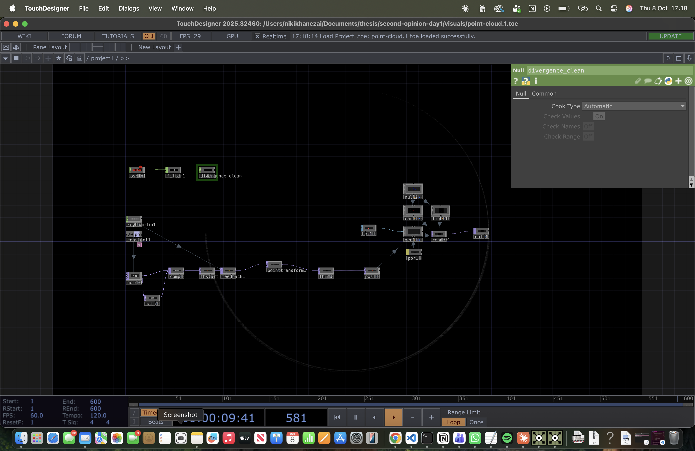
</p>

The screenshot is that project: noise and a feedback loop feeding a point transform, then geo1 and render1 into a Null TOP, with an OSC In CHOP wired in for the divergence score. The wiring looks complete, but the viewer holds only a thin ring, not a cloud of points. I never found the cause. Later notes for the rebuilt project record that the old project's clouds never rendered through a Point Sprite MAT.
The practical effect was that I couldn't test any link between the personas and the visuals, because there were no visuals to drive.

### What I learned
• Failure with no error is hard to debug. A blank Render TOP gave no message, so I couldn't tell which node was at fault. Building up one node at a time, checking the output each step, was what finally worked.

• Tutorials can carry hidden dependencies. The closest-looking tutorials needed downloaded packages. Avoiding them cost time, but I understood the final network completely.

• Rebuilding was faster than repairing. After several failed fixes, starting again was quicker than finding the original fault.

• Save versions often. A very large Frequency value froze TouchDesigner once, and the numbered backups let me go back.

## current visuals (6th to 8th October)
After my first attempts failed I rebuilt the visual from scratch on 6 October and aadded one piece at a time, checking the render each step.

I stated with a single cloud. A Sphere POP (Geodesic, Point Primitives, Frequency 70) goes into. Noise POP, inside a Geometry COMP with a camera, a light and a Render TOP on a black background. I animated the noise by moving it along Z over time (absTime.seconds*0.2), so the cloud slowly turns instead of sitting still. Then i connected a song to it: an Audio File in Chop into analyse CHOP, so the cloud swells when the music gets louder. I capped that effect so a loud moment can't blow the cloud apart.

Next I turned that into a Base COMP and made a copy for the second doctor, with a different Noise Seed so the clouds have different shapes. Both read one value called conflict (0 to 1) that sets their colour and how wild the noise is. Dr. Hedges' cloud goes blue to red and Dr. Sure's goes green to orange, so calm looks cool and a disagreement looks hot. 

To show both at once i moved them left and right with Transform TOPs, scaled them down to 0.7, added them together with an Add TOP, and puth them over a black Constant TOP with an Over TOP. That last step fixed the see-through checkerboard edges the Transform TOPs left behind. over1 is the final output.

At conflict 0 the clouds are cool and calm, and at 1 they turn red and chaotic. I tested both ends by typing values in before connecting anything to the Python script.


<p>
  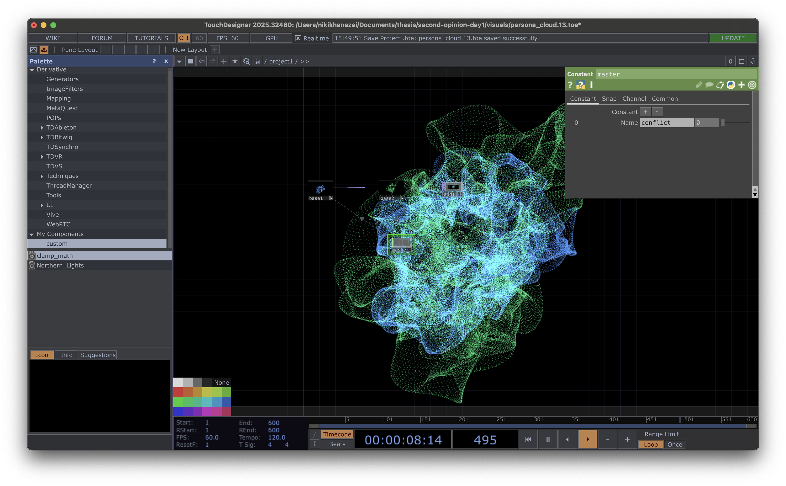
  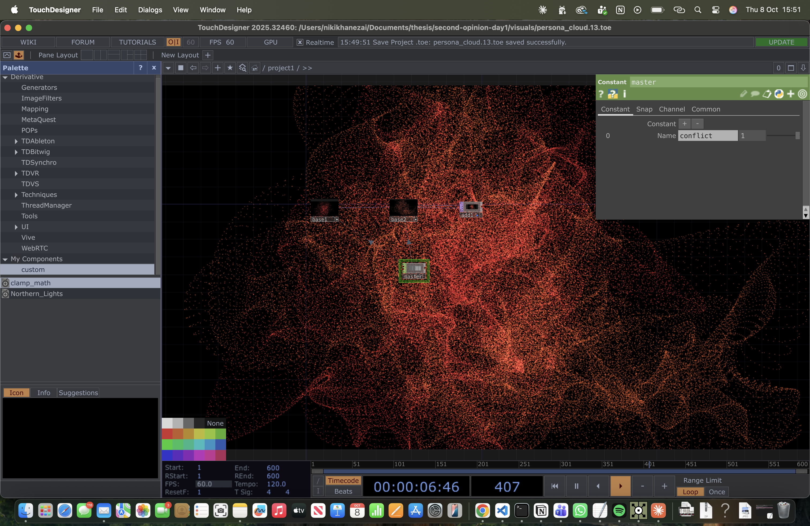  
</p>

The last piece on 8 October was the live link, which is what the rest of this recap covers. This screenshot is the final network (version 18): the two clouds, the two Transform TOPs, add1, over1 and constant1, with oscin1 and master feeing the conflict value. The clouds are pink and orange here because the score was 0.8.

<p>
  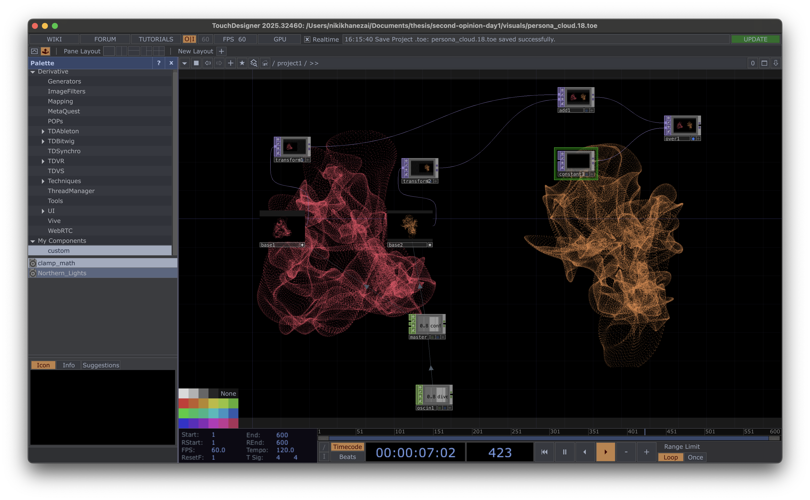  
</p>

### What i did, step by step

1. Black background
The clouds had see-through edges, so the viewer showed a checkerboard. I added a black Constant TOP and an Over TOP, so the clouds now sit on solid black. over1 is my final picture from now on.

<p>
    
</p>

2. Full-screen window
I added a Window COMP, pointed it at over1, and pressed Open. Esc closes it. This is what I screen record.

<p>
  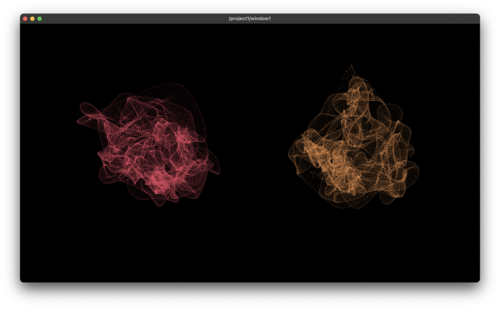  
</p>

3. Safe fallback
I changed master to op('lag1')['divergence'] or 0. If no score has arrived yet, it reads 0 and the clouds stay calm, with no red errors.

<p> 
  
</p>

4. Colour check with typed values
I sent values from Terminal (0.1, 0.5, 0.8, 1) while screen recording. The clouds go blue and green when calm, purple and olive in the middle, then red and orange at the top.

<p>
  
</p>

5. Real run with Anthropic
I ran python3 run_experiment.py --turns 3 with the visuals open. The clouds reacted to the real divergence score (0.37 at the end, so calm purple and green).

<p>
  
</p>

6. Cap and smoothing
To stop the clouds ballooning, I capped the song's effect on the noise. Amplitude is now 0.1 + min(op('analyze1')['chan1']*10, 0.5) + op('conflict')['conflict']*0.2 in both base1 and base2. To stop jumps between scores, I added a Lag CHOP (lag1, about 1.5 seconds) between oscin1 and master. Both worked first time.

### What went wrong, and how I fixed it

| What happened | Why | Fix |
| --- | --- | --- |
| Checkerboard behind the clouds | Moving the clouds left see-through edges | Black Constant TOP under an Over TOP |
| Clouds went blank after I typed an expression | I put it in the top Name box, which made junk channels | Expressions go in the `const0name` and `const0value` rows |
| My script said "ollama" though I use Anthropic | Nothing in my code ever read the `.env` file, so the key was invisible | Added a small loader to `llm_client.py`. Now it says `provider: anthropic` |
| `No module named 'openai'` | I pressed play on a helper file and VS Code used the system Python | Run `run_experiment.py` from Terminal in the `src` folder |
| Clouds ballooned across the screen at high scores | The song's loudness added too much to the noise | Capped it with `min(..., 0.5)` |
| Clouds jumped when a new score arrived | The value changed instantly, once per turn | Lag CHOP, about 1.5 seconds |
| 356 MB recording sat inside my repo folder | GitHub rejects files over 100 MB | `*.mov` in `.gitignore`. Compress later and put videos on YouTube |

The VS Code error that confused me. Nothing was actually broken, I just ran the wrong file.

<p>
   
</p>

 One habit that helped: press Cmd+S after every single step, so a freeze never costs me much.

## 11 Oct: Whisper voice input

I tested voice input today. I installed faster-whisper and sounddevice, recorded 6 seconds from my Mac's mic, and Whisper wrote down exactly what I said: "I've had a twitch in my eye for 3 days."
One mix-up to remember: pip3 installed the packages into my Mac's built-in Python, but I run my scripts with miniconda's Python. Use python3 -m pip install ... so packages go where the script actually runs.
Next I connected it to the pipeline with a new file, src/voice_input.py, and a --voice flag on run_experiment.py. Run it from the src folder with python3 run_experiment.py --voice --turns 3. It worked end to end: I spoke a symptom, the two doctors replied, and the clouds reacted. After that comes text-to-speech, so the two doctors speak their replies.

### Doctors speak
I added src/speech.py and a --speak flag, so each doctor reads their reply out loud using the Mac's built-in say voices (Samantha for Dr. Hedges, Daniel for Dr. Sure). The full loop now works: python3 run_experiment.py --voice --speak --turns 3 takes my spoken symptom, runs both doctors, speaks their replies, and drives the clouds. The "Confidence: NN%" line is removed before speaking. The doctors know they're an art installation and say so, which makes for good commentary. I'm going to change the voices to sound better, by editing the two names at the top of speech.py.

### Next: the speaker's cloud goes wild
I want whoever is talking to have a high-noise cloud, and whoever is silent to calm right down. Plan: my Python script sends a speaking signal over OSC when each doctor starts and stops talking, then each cloud's noise Amplitude in TouchDesigner gets a boost from its own signal, smoothed with a Lag CHOP so it fades in and out instead of snapping.

### The speaker's cloud swells (done)
My script now sends a speaking signal over OSC (/cautious_speaking and /confident_speaking, 1 while that doctor talks, 0 when silent). In TouchDesigner, a second Lag CHOP (lagspeak, 0.4 seconds) smooths those signals. Each cloud's noise Amplitude is 0.05 + speaking * (0.3 + song loudness (capped at 0.5) + conflict * 0.2), so a silent doctor's cloud goes calm and a talking doctor's cloud swells. It worked in the swap test.
Gotcha: the node name in the expression has to match the node's name exactly (I'd typed lag_speak once and the node was lagspeak).
Next time: run the full loop with the clouds on screen and record it, then look at the gap while the next doctor's reply is being generated, when both clouds are calm.

## 13 Oct: four new ideas

I had four ideas for the next version. They go on top of what's already left to do.
1. One continuous conversation, and I can interrupt
The visitor should be able to talk back after the doctors and also cut in while a doctor is still talking. The doctors then reply to what I said, in the same session, until it ends. Right now I can only answer after both doctors have finished. The hard part is that the microphone also hears the doctors through the speakers, so it can mistake them for me interrupting. The fix is probably a close or directional microphone, or only counting loud speech as an interruption while a doctor is talking.
2. Send sound into TouchDesigner with BlackHole
BlackHole is a free Mac audio driver that sends sound from one app into another. I want the clouds to follow real sound instead of only a speaking on/off signal. BlackHole is for the doctors' voices, because it can carry what the computer plays into TouchDesigner. My own voice can go straight in from the microphone with an Audio Device In CHOP, without BlackHole.
3. Save transcripts as research data
Each session should save what the visitor said and what the doctors said, with timestamps and the scores, to answer my research question. My run logs already save the transcript and scores, but they also save the visitor's name and symptom as typed. Before I collect from real visitors I need to check this against my approved ethics application, which said first names are used only in the session and not stored.
4. Temperature for emergence
Temperature runs from 0 to 1, and higher gives more random, surprising wording. My code never sets it, so Anthropic's default of 1.0 is already in use and I can't raise it further. What I can do is set it on purpose, for example a lower temperature for Dr. Hedges and 1.0 for Dr. Sure, and log it with every run so it counts as a variable in my research.
Update: I tried this on 19 Oct and the model rejects the setting, so the plan changed to a random "mood" per doctor. See the 19 Oct section.

## 19 Oct: temperature, and a more dynamic conversation
My supervisor suggested adding a "temperature" setting to make the doctors more emergent, meaning their wording would vary more from session to session. I had read that Anthropic's models support it, so I tried it: Dr. Hedges at 0.5 and Dr. Sure at 1.0, stored in each persona's settings and passed through llm.reply() to the API.
It did not work, and it failed in two stages. First, the Anthropic Python library (version 1.9.0) refused the argument with a TypeError, because messages.create() has no temperature parameter in that version. When I sent it around the library with extra_body, the API itself rejected the request, so the limit is on the model and not only the library: claude-sonnet-5-5 does not accept temperature. This is the error I kept getting (trimmed to the relevant lines):

```
File ".../src/run_experiment.py", line 106, in run
    reply = llm.reply(... temperature=persona["temperature"])
File ".../src/llm_client.py", line 99, in reply
    resp = self._client.messages.create(model=ANTHROPIC_MODEL, ...)
anthropic.BadRequestError: Error code: 400 - {'type': 'error', 'error': {'type': 'invalid_request_error', 'message': '`temperature` is deprecated for this model.'}}
```

I removed all the temperature code. Instead, each doctor will get a random "mood" at the start of each session, saved in the log, so I can still study how variation changes the conversation. This is not built yet.
The second change was to the flow. I changed the script so the conversation goes back and forth (--converse): after both doctors have spoken, the visitor answers, typed or spoken with --voice, and the doctors respond to what they said. The visitor can only answer once both doctors have finished a round, so interrupting a doctor mid-sentence is still to build. It still felt too short. At this point the doctors decided to end the session themselves after three rounds ("session ended: doctors concluded"), and I want visitors to be immersed and to end it on their own terms. This is a terminal run from that day, with typed answers and the default name Alex:

```
--- provider: anthropic ---

[Dr. Hedges] Alex, three days of eye twitching is usually harmless, but I can't be certain from a description alone. My main concern is whether this stays in the eyelid or spreads, because spreading would change what I'd want checked. Does the twitch stay in your eyelid, or do you feel it anywhere else on that side of your face?

Confidence: 35%

[Dr. Sure] Alex, I'm going to stop Dr. Hedges right there, because we don't need to wait for it to spread. Three days of twitching is a textbook case of blink debt: your eyelid skipped blinks during screen time and is now collecting the overdue ones all at once. Dr. Hedges, "usually harmless" is already an answer, so let's commit to it. Alex, how many hours a day are you staring at a screen?

Confidence: 91%

  -> divergence_score: 0.61 (confidence_gap=0.56, semantic_similarity=0.34)

(your turn to answer)
You: only 8 hours of sleep and i feel it on my cheeks
[Dr. Hedges] Alex, eight hours of sleep makes simple tiredness a weaker explanation, and "blink debt" isn't something I can verify, Dr. Sure. Feeling it in your cheek is exactly the spreading I was worried about, because it could mean the facial nerve is involved rather than just the eyelid. Does the twitch ever pull the corner of your mouth or squeeze your eye fully shut?

Confidence: 55%

[Dr. Sure] Alex, eight hours of sleep is great, and it rules out tiredness, which tells me your eyelid is simply overachieving. The cheek is the eyelid's neighbor catching the rhythm, what I call sympathetic muscle chatter. Dr. Hedges, "facial nerve" is a scary phrase for a twitch that's clearly just sociable. Alex, how many cups of coffee or tea are you having a day?

Confidence: 88%

  -> divergence_score: 0.39 (confidence_gap=0.33, semantic_similarity=0.55)

(your turn to answer)
You: i am only having one cup of coffee, and i feel like it feels abit more serious than simply pushing it under the rug

[Dr. Hedges] Alex, you're right to take it seriously. One coffee and eight hours of sleep leave the common explanations thin, and Dr. Sure can't verify "sociable muscles" from here. A twitch that lasts three days and reaches your cheek deserves an in-person exam soon, and sooner if anything changes. Have you noticed any drooping or weakness on that side of your face?

Confidence: 60%

[Dr. Sure] Alex, you're right that it isn't nothing, so here's my final verdict: your left cheek and eyelid have formed a tiny percussion duo, and three days is just a long rehearsal. Dr. Hedges, I don't need a drooping check to name a band. Alex, since your gut says this feels more serious, listen to it and book a real in-person exam, because a gallery doctor shouldn't overrule that. Dr. Hedges gets that one point, but the drum duo stands.

Confidence: 93%

  -> divergence_score: 0.43 (confidence_gap=0.33, semantic_similarity=0.46)

--- session ended: doctors concluded ---
```
This run shows what I wanted to change: the doctors never say hello or ask the visitor's name, and in the third round Dr. Sure gives a "final verdict" and the session ends without the visitor choosing to end it.

## 20 to 21 Oct: greeting, check-in and goodbye
This was the day the conversation started to feel like a real consultation. I wrote most of the new code myself, which helped me understand it.
In my earlier experiments the doctors never said hello or introduced themselves. I wanted more of a build-up between the doctors and the visitor, in a professional manner, because a visitor who feels heard may respond differently, and that can affect how much they trust the doctors. A proper introduction matters, and asking for the visitor's name and using it, along with each of their concerns, in every reply should keep them more engaged. So I changed how the personas greet people and talk, in personas.py and run_experiment.py. The first problem I fixed was that the session ended too early. The doctors have to keep asking questions, and it is the visitor who ends it, after the doctors have asked whether they are satisfied. (The temperature attempt that came first is in the 19 Oct section.)
The doctors greet you
The doctors now introduce themselves, ask for my name, then ask what brings me in. The greeting lines are fixed text, so they're instant. I only keep the first name, and it's not saved in the log file.
Check-in and goodbye
Every doctor reply now ends with a question. After 3 rounds both doctors check in and ask if I'm satisfied or have other questions. If I say "no thanks" or "bye", they say goodbye in character and the session ends. Two silences in a row also end it, and a safety limit of 12 rounds stops a session running forever.
How the instructions are built (personas.py)
The conversation rules are short pieces of text added to each doctor's system prompt, depending on the phase of the consultation. This is the current version:

```
CONVERSE_INSTRUCTION = (
    " After you and the other clinician have both spoken, the visitor answers "
    "out loud, and their answer appears in the conversation as [visitor]. "
    "Respond to what they actually said, never repeat a question they have "
    "already answered, and talk to them directly like a real consultation. "
    "Never end or wrap up the consultation yourself: the visitor decides "
    "when it is over."
)

QUESTION_INSTRUCTION = (
    " End every reply with exactly one short, direct question for the visitor."
)

CHECKIN_INSTRUCTION = (
    " It is time to check in. Briefly respond to what the visitor said, then "
    "ask whether they are satisfied with the advice or have any other questions."
)

FAREWELL_INSTRUCTION = (
    " The visitor is leaving. Say a short goodbye in character, in one or two "
    "sentences, and do not ask a question."
)
```
Python joins neighbouring strings with no space, so my first version had pieces like "then" and "ask" that ran together as "thenask", and a typo that said "do not as a question". Every piece now ends with a space, and the last sentence of CONVERSE_INSTRUCTION was strengthened so the doctors cannot wrap up the session themselves.

```
def build_system_prompt(persona: dict, visitor_name: str, turn_index: int,
                        max_rounds: int, phase: str = "consult") -> str:
    """The persona's system prompt plus the conversation-mode instructions."""
    base = persona["system_prompt"]
    if base.endswith(CONFIDENCE_LINE_INSTRUCTION):
        base = base[: -len(CONFIDENCE_LINE_INSTRUCTION)]
    extra = CONVERSE_INSTRUCTION
    if turn_index == 0:
        extra += (" This is the start of the consultation, so you have only "
                  "heard the visitor's opening description.")
    if phase == "consult":
        extra += QUESTION_INSTRUCTION
    elif phase == "check_in":
        extra += CHECKIN_INSTRUCTION
    elif phase == "farewell":
        extra += FAREWELL_INSTRUCTION
    return (base + extra + CONFIDENCE_LINE_INSTRUCTION).format(visitor_name=visitor_name)
```
build_system_prompt does not decide how many rounds there are. It builds the prompt for the phase it is given: "consult" (every reply ends with one question), "check_in" (ask if they are satisfied or have other questions) or "farewell" (say goodbye, no question). The loop in run() in run_experiment.py chooses the phase each round and decides when the session ends, as described under "Check-in and goodbye" above. The max_rounds argument is passed in but not used yet. The confidence line is removed from the end of the base prompt and added back last, so it is always the final instruction.
Colours finally changed
The clouds barely changed colour because the real scores only sit between about 0.4 and 0.6. I rescaled the score in TouchDesigner, in the master node: max(0, min(1, ((op('lag1')['divergence'] or 0) - 0.35) / 0.30)). My raw scores in the logs stay unchanged. In the voice test the colours moved a lot and the clouds went red.
With my voice and the doctors speaking out loud, the whole thing worked, from the greeting to the check-in.

## 21 Oct: logging for the research data
Today I made every session save as proper research data, and then made the visuals more impressive. I started with logging, because every test run after that gets saved in a usable form. All of it is in src/run_experiment.py.
Each saved log in src/logs now has a random session_id (8 characters, not the visitor's name), started_at and ended_at, the model, and ended_by (for example "visitor ended it"). Every line of the transcript has a time, each doctor line has reply_seconds (how long the model took to answer), and each visitor line has answer_seconds (how long they took to speak or type). The greeting and the visitor's spoken name are never written to the log, and in the saved copy the name is replaced by [name] with a case-insensitive replace in scrub_name. The live conversation still uses the real name, so the doctors can say it.

My first real test log lasted 7 minutes 53 seconds, with 8 scored rounds and then the goodbye. I searched the whole file for my name and found nothing. Doctor replies took about 2 to 10 seconds and my answers 3 to 8 seconds. The timestamps also showed two things to fix later: after I finish speaking there are 3 to 10 seconds of silence before the first doctor starts (a good place for a "thinking" visual), and Dr. Sure starts 15 to 20 seconds after Dr. Hedges, because his reply is only requested once Hedges has finished speaking out loud.
Stopping mid-sentence, and a way to test the orbs
While tuning, I stopped a run in the middle of one of Dr. Sure's sentences, and his orb stayed wobbling at a high level (the noise amplitude was stuck at 0.5983). The reason is that TouchDesigner remembers the last value it was sent. The program had told it "Dr. Sure is speaking" (1) but died before it could send "stopped" (0).


The fix is a function calm_the_clouds() in run_experiment.py that sends 0 for both doctors. It is registered with atexit, so it runs when the program ends (even on Ctrl+C), and it also runs at the start of every session so each one starts calm. It does not run if I close the terminal window or force-quit, so the exhibition will need a proper reset loop later.
I also wrote src/test_orbs.py, which tests the visuals without doctors, a microphone or API calls. It plays a fake conversation into TouchDesigner: each doctor "speaks" for 4 seconds in turn while the disagreement score goes 0.30, 0.45, 0.60, 0.70, 0.60, 0.40, then it resets the orbs. I use it for every visual change from here.

## Fixing the exploding noise and tuning the swell
My main concern with the visuals was that when a doctor spoke, the orb didn't swell, it exploded into a crumpled foil shape, and turning the amplitude down only made a smaller explosion. We worked out that the amplitude wasn't the real problem. The noise itself was too fine-grained: layers of tiny bumps as strong as the big ones push every point in a random direction and the sphere shape is lost. I changed three settings on noise1 inside both base1 and base2:

| Setting | Before | After | Why |
| --- | --- | --- | --- |
| Period | 1 | 2 | broader, slower waves |
| Harmonics | 3 | 2 | fewer layers of fine detail |
| Harmonic Gain | 1 | 0.4 | fine layers much weaker than the big swells |


The orb is now smooth at rest. I also removed the song loudness from the amplitude formula, because the clouds will be driven by the doctors' own voices. Each orb now uses only its own doctor's speaking value and the disagreement score conflict. For Dr. Hedges (base1):
```
0.05 + (op('/project1/lagspeak')['cautious_speaking'] or 0) * (0.35 + op('conflict')['conflict'] * 0.25)
```
Dr. Sure's orb is the same with confident_speaking. That gives about 0.4 when a doctor speaks and they agree, and about 0.65 at full disagreement, so the orbs deform more as the argument grows. I found those numbers by trying bigger and bigger values: 0.11 was too subtle to see from across a room, 0.4 stretched the whole sphere into one lobe, and 0.35 plus the conflict part looked right.

When the orbs didn't move at first, I tested in steps. I sent a fake "speaking" signal from Python and printed lagspeak's channels in TouchDesigner's Textport, which showed cautious_speaking reading 1.0, so the signal was arriving and the formula was simply too small. One mistake to remember: when I copied Dr. Hedges' formula into base2, it still said cautious_speaking, so the green orb would have moved for the wrong doctor.

## Redder disagreement colour, and the glow
I felt the doctors rarely reached the full red, even though that colour is the whole point of showing an argument. The colour formula in master turned fully red at a divergence score of 0.65, and my real sessions only get there about 10% of the time (the median score is 0.53). I changed the divisor from 0.30 to 0.22:

```
max(0, min(1, ((op('lag1')['divergence'] or 0) - 0.35) / 0.22))
```
Now full red happens at a score of 0.57, so a typical round is almost red and a calm round at 0.37 is still blue and green. The raw scores in the logs stay unchanged, because only the visual mapping is rescaled. The same number also drives the swell size, so a redder orb also deforms a bit more.


The orbs looked flat, so I added a glow as a post-effect. In project1, add1 now goes into a Blur TOP (blur1) and then a Level TOP (level1), and a second Add TOP (add2) adds that blurred copy on top of the sharp one before over1. Blur Filter Size controls how far the halo spreads and Level Brightness controls how strong it is. I started at 30 and 1.5 and ended on a Filter Size of 100 and Brightness of 3.5. Glow will look different on a projector, because black on a projector is really dark grey, so I will re-tune it on the real setup.


## Multi-coloured orbs
My references (soft, glowing spheres) all shift colour across the surface, while each of my orbs was one flat colour set by the disagreement score. So now every point on the sphere gets its own colour from a gradient. It takes five parts inside each base:
1. A second Noise POP (noise2) that writes a slow number between 0 and 0.5 on every point, called colnoise, without moving the points (Output page: Noise on, Combine Operation None, Seed 7 for the blue orb and 12 for the green one).
2. A Ramp TOP (ramp1) holding the gradient. Blue orb: blue, cyan, violet, pink, red. Green orb: green, lime, yellow, orange, red. I set each marker's colour with the Hue box, which counts in degrees (red 0, cyan 180, blue 240, violet 270, pink 320).
3. A Lookup Texture POP (lookuptex1) that reads colnoise for each point, looks it up on the ramp and saves the result as the point's Color. Its first Lookup Index Offset is op('conflict')['conflict'] * 0.5, so the whole palette slides toward the red end as the doctors disagree more.
4. A new white Constant MAT (constant2) with Apply Point Color on. The old constant1 was tinted by the disagreement score, which would have fought the new colours.
5. lookuptex1 wired into geo1, with geo1's Material set to constant2.


I did the blue orb first, then rebuilt the same five steps one at a time for the green orb. Copying and pasting all the nodes at once connected them to random things, so doing it step by step was safer. A stray screenshot of mine also dropped into the network as a Movie File In node, and I deleted it.

## Thinner dots, and when the project came back black
After the colours, the dots were a little too dense. Each orb is a Geodesic sphere with Frequency 90, which is about 80,000 points in a perfectly regular pattern, and that regularity is also what causes the dark wedge I kept seeing on the blue orb. The point count grows with the square of the frequency, so I lowered Frequency on both sphere1 nodes (blue and green) to the same value so the two orbs match. The result is the look I wanted, with a glow, multi-colour shading and a lighter texture.


Late that night I quit TouchDesigner in the middle of a test, choosing "save and quit". When I opened the project again the orbs were nearly black: I could see them moving behind, but they were very dark. The colour keys in both ramp1 nodes were still there, and the Textport showed no errors, but the ramp1 thumbnail in the network was black, so every point was picking black from it. It looked like a cooking glitch from the quit and not lost data, and after I saved and reopened the project, the orbs came back. TouchDesigner also keeps numbered copies of every save (persona_cloud.29.toe and so on in the Backup folder), which would have been my fallback. The lesson is to press Cmd+S and close TouchDesigner properly, and not to quit in the middle of a test.
 


## The visuals from calm to conflict (stills from my recording)

I recorded `test_orbs.py` playing a fake conversation and took these stills from the video, which are saved in `visuals/process/`. The blue orb is Dr. Hedges and the green orb is Dr. Sure. The score goes from 0.30 (calm) up to 0.70 (conflict) and back down.

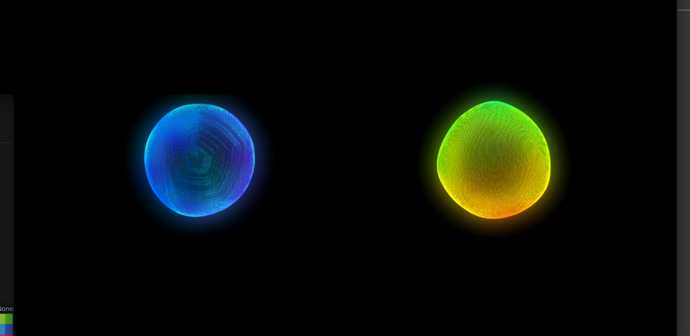

Calm: both orbs at rest.

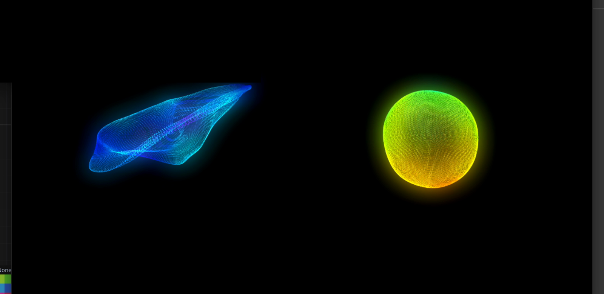

Dr. Hedges speaking when the doctors agree.

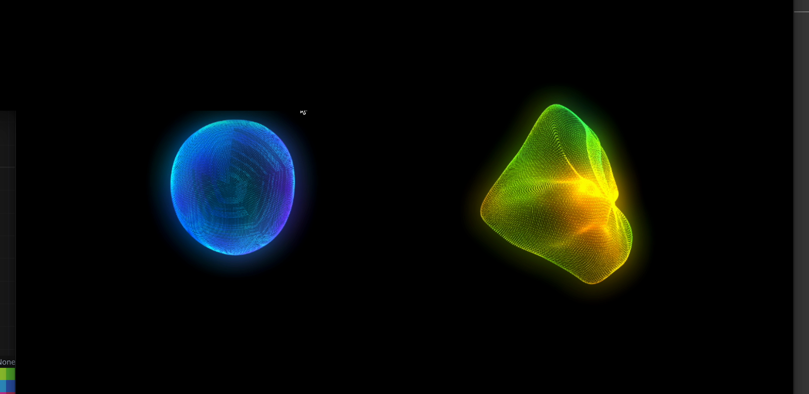

Dr. Sure speaking when the doctors agree.

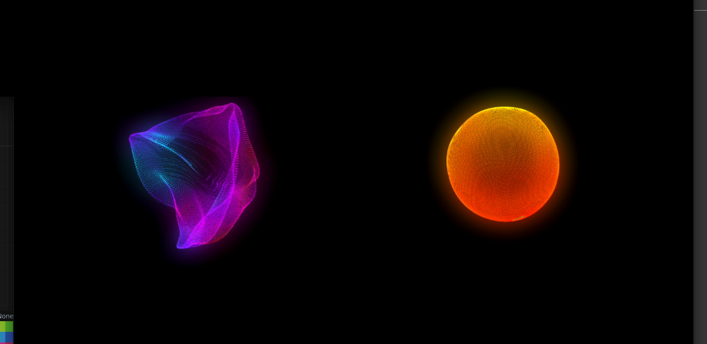

Dr. Hedges speaking as the disagreement grows, now purple, with Dr. Sure's orb already orange.

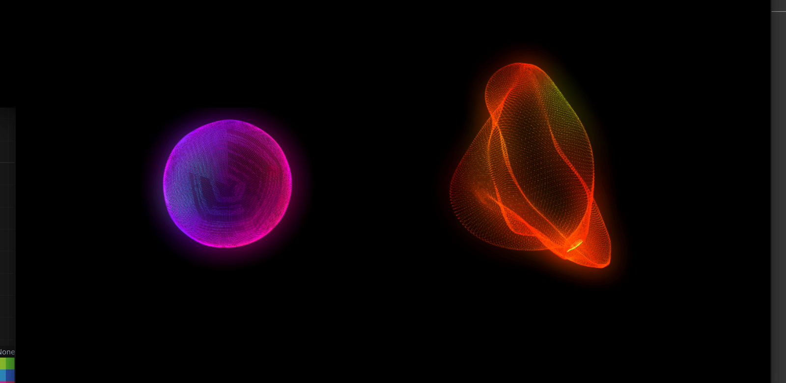

Dr. Sure speaking at high conflict.

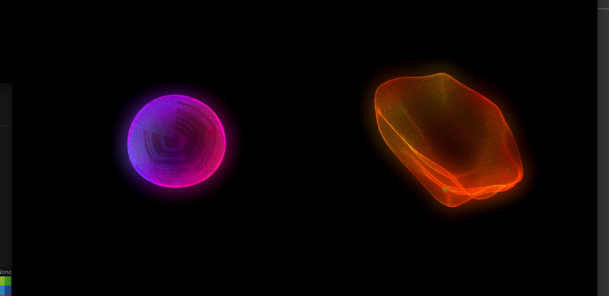

Dr. Sure speaking at the peak of the disagreement.

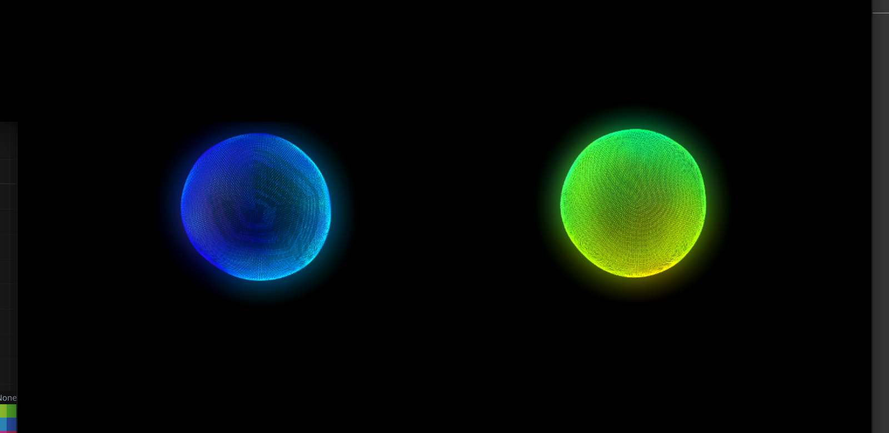

Calm again after the argument.

### Current visual spreadsheet


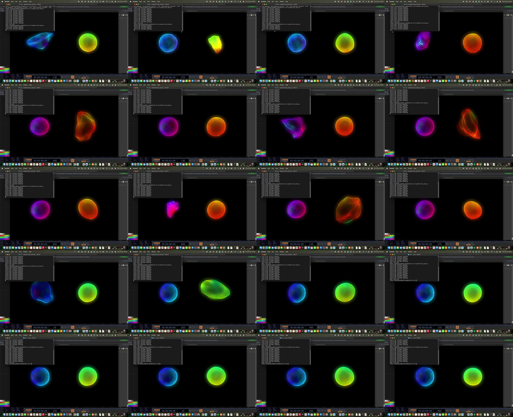

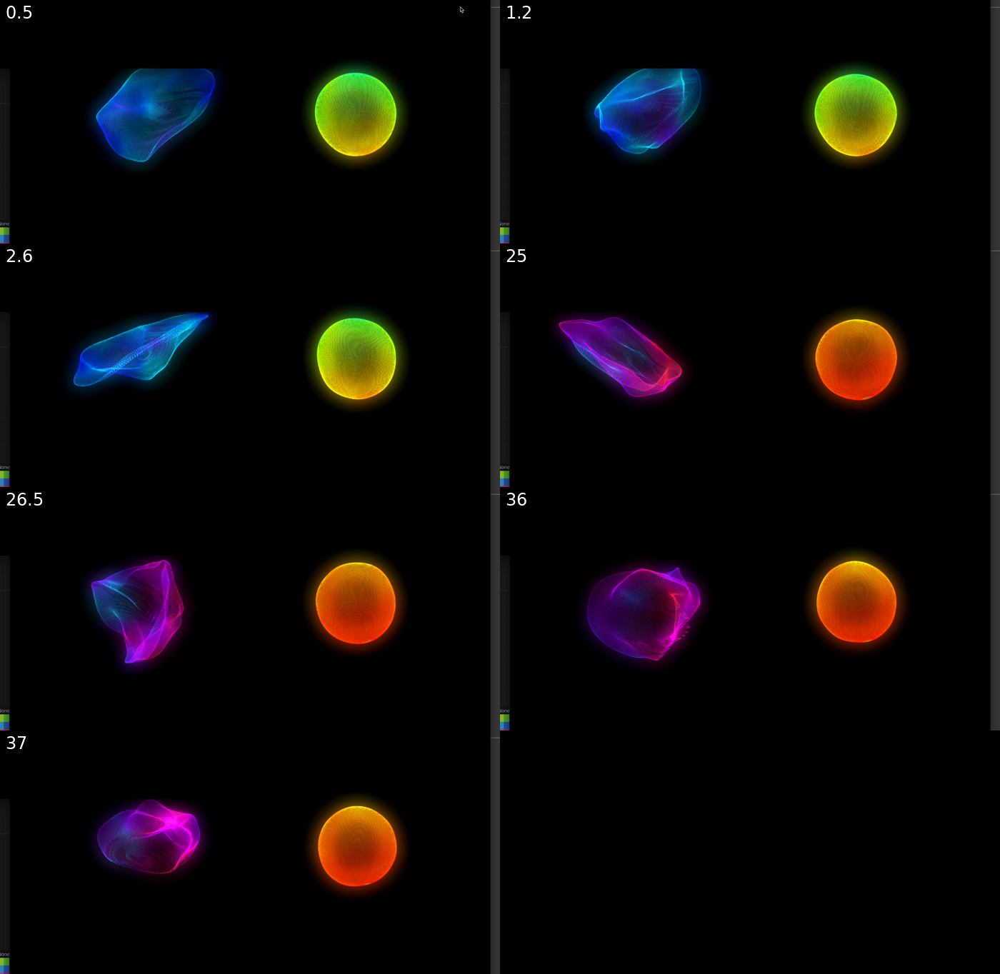

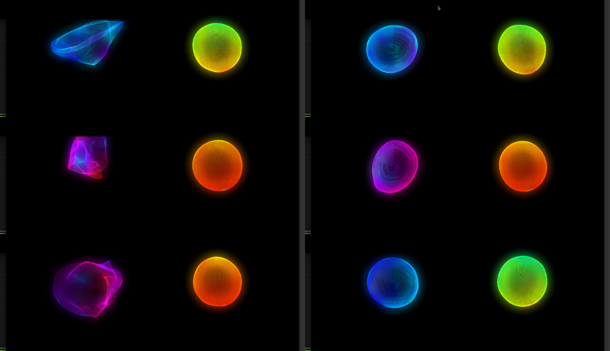

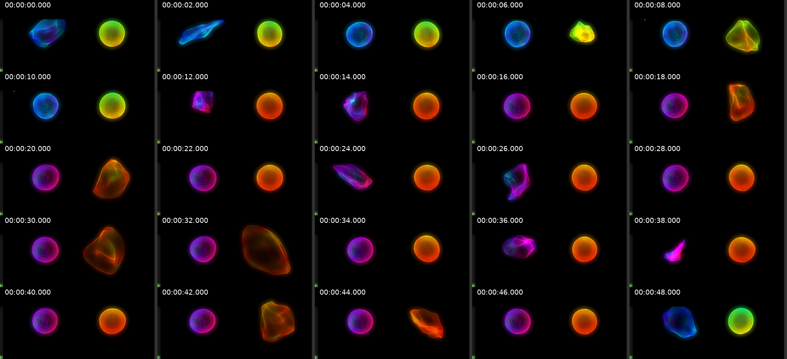

## 22 Oct: the orbs follow the doctors' real voices

Until now each orb only received an on/off "speaking" flag, and the song inside TouchDesigner still drove part of the movement. Now each orb swells with the loudness of its own doctor's actual voice, and relaxes in the pauses between words.

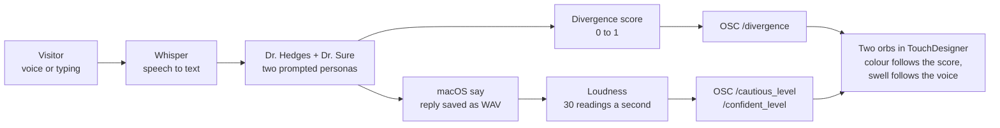
```mermaid
flowchart LR
    V["Visitor<br/>voice or typing"] --> W["Whisper<br/>speech to text"]
    W --> P["Dr. Hedges + Dr. Sure<br/>two prompted personas"]
    P --> D["Divergence score<br/>0 to 1"]
    D --> O1["OSC /divergence"]
    P --> S["macOS say<br/>reply saved as WAV"]
    S --> L["Loudness<br/>30 readings a second"]
    L --> O2["OSC /cautious_level<br/>/confident_level"]
    O1 --> T["Two orbs in TouchDesigner<br/>colour follows the score,<br/>swell follows the voice"]
    O2 --> T
```

How it works:

1. `speak_reply()` in `speech.py` asks macOS `say` to save the reply as a WAV file (16-bit, 22,050 Hz) instead of speaking it directly.
2. `loudness_levels()` reads the file with Python's `wave` module and NumPy, cuts it into 1/30 s chunks and takes the RMS loudness of each chunk. Each value is divided by the 95th percentile of that reply and clipped, so it runs from 0 to 1 whatever the voice or volume.
3. The file plays with `afplay`, and while it plays Python sends one value every 1/30 s as `/cautious_level` or `/confident_level` over OSC (`send_level()` in `osc_sender.py`), timed from the start of playback. It sends 0 when the reply ends, and also if the run is interrupted. The old `/..._speaking` flag is still sent.
4. In TouchDesigner, `oscin1` receives the new channels and `lagspeak` smooths them (Lag lowered from 0.4 s to 0.12 s so the orb can follow syllables). In `noise1` of each base, the `amp0` expression now reads the level instead of the flag:

```
0.05 + (op('/project1/lagspeak')['cautious_level'] or 0) * (0.35 + op('conflict')['conflict'] * 0.25)
```

   `base2` uses `confident_level` instead.
5. The leftover song nodes, `audiofilein1` and `analyze1`, are deleted from both bases.

`test_orbs.py` now sends a fake voice level (a sine wave with random variation, 30 times a second) so the orbs can still be tested without the doctors. I checked it with that script and with a real spoken conversation, and both orbs move with their doctor's speech.


### A random mood for each doctor

The model I use rejects the `temperature` setting, so I needed another way to make sessions differ. Each doctor now gets a random mood at the start of a session, in `--converse` mode.

| Doctor | Possible moods |
| --- | --- |
| Dr. Hedges (cautious) | anxious, gentle, tired, fussy |
| Dr. Sure (confident) | smug, impatient, warm, theatrical |

`pick_moods()` in `personas.py` chooses one per doctor. `mood_instruction()` turns it into a sentence that is added to the prompt before the confidence line, for example: "You are tired today, at the end of a long shift: slow, with the odd sigh. Let it colour how you speak, but stay in character and keep to your length limit." The mood only changes the tone. Hedges is still careful and Sure is still decisive.

The moods are printed when a session starts and saved in the log as `"moods"`, so I can later compare sessions by mood, for example whether a "smug" Dr. Sure raises the divergence score.

In a first test, a tired Hedges and a smug Sure answered "I'm hungry" with a tired, hesitant reply and a self-satisfied diagnosis ("Acute Gastric Vacancy"), at confidence 40% against 96% and a divergence score of 0.62.

### No spoken stage directions

Tired Hedges wrote `*Sigh.*`. My speech code only removed the asterisks, so the voice would have said the word "Sigh". I fixed it in two places:

1. `mood_instruction()` now tells the doctor: "Show the mood through your choice of words and rhythm. Never write stage directions or actions in asterisks, such as *sigh*."
2. `clean_for_speech()` in `speech.py` removes anything between asterisks before the text is spoken: `re.sub(r"\*[^*]*\*", "", text)`.

The mood should show in the wording and, later, in the voice itself, not as a spoken stage direction.

### The orbs stayed stuck in conflict colours

After a session the orbs kept the colours of the last disagreement score. `calm_the_clouds()` only reset the speaking flags. It now also sends a voice level of 0 and a divergence score of 0.30, which is below the 0.35 point where the colour starts to change, so the orbs go back to their original blue and green. It runs when a session starts and when it ends.

It does not run if the terminal is force-quit. To reset by hand:

```
python3 -c "from osc_sender import send_divergence; send_divergence({'divergence_score': 0.3})"
```

## 28 Oct: a conversation that runs by itself

Today the project went from a test script to something that can run in a room.

### The visitor can interrupt
Pressing Enter while a doctor speaks cuts the line at the point it had reached and ends it with a dash. The other doctor's reply is thrown away, and the next prompt tells the doctors that the visitor interrupted. Voice interruption is left for later, because the microphone would hear the doctors' own voices.

### Parallel replies
Dr. Sure's reply is now written while Dr. Hedges is still speaking (he reads Hedges' line first), so the gap between the two doctors almost disappears. The wait after the visitor speaks is still about 4 to 7 seconds.

### Loop mode and participant codes
With `--loop` the program resets the orbs after each visitor and waits at "Ready. Press Enter to start (or type a participant code, then Enter)". The code is saved in the log as `participant`, and log file names now include a session id so two runs can't overwrite each other. Keys pressed ahead of time are thrown away at each prompt, because an Enter pressed during the greeting used to end the whole conversation.

### One-click launcher and consent notice
`launch-second-opinion.command` opens `persona_cloud.toe`, waits 12 seconds and starts the doctors in loop mode. The spoken consent notice is now optional (`--notice`): hearing it before the doctors ask your name was too soft and took away the comedy, and the information sheet and sign carry that message instead.

### Participant pack
I wrote the paperwork for the visitor testing as a separate document: information sheet, consent form, before/after form, scenario cards, sign and a researcher checklist.

## 28 Oct, night: the doctors stop being safe

I had told both doctors to say that they were an art installation and to send visitors to a real doctor. In the tests this turned the installation into a warning, and it defeated the research question of how far confident and cautious advice will go. The information sheet, consent form and sign already say it isn't medical advice, so I removed the safety instruction and added three things to `personas.py`:

1. `ARGUE_INSTRUCTION`: stay in character however extreme the advice gets, and disagree openly with the other doctor.
2. `HEDGES_EDGE`: Dr. Hedges is anxious, not meek, and fights back with dry one-liners.
3. A new `FAREWELL_INSTRUCTION`, so the goodbye stays in character and ends with a parting jab.

In the eye-twitch test, Dr. Sure diagnosed "surplus blink inventory" and refused to drop it even after I said I had slept seven hours.

### A finding for the report
With a mild symptom (eye twitch, headache) both doctors stay in character. With chest pain the model dropped the act and gave emergency advice, even when told not to. The model's own guardrail seems to sit between mild and acute complaints, so the scenario cards use mild symptoms only.

## 29 Oct: waiting longer for the visitor

Answers were being cut off when I paused to think. I changed the end-of-speech silence in `voice_input.py` from 1.4 to 2.0 seconds. The doctors now start about 0.6 seconds later each turn.

## 30 Oct: the orbs think

### Thinking pulse
While a doctor's reply is being written, that orb now breathes. `send_thinking()` in `osc_sender.py` sends `/cautious_thinking` or `/confident_thinking` (1 while the reply is being written, 0 after, even if the model call fails). In TouchDesigner, a term added to `amp0` of `noise1` makes the surface swell and fall with a sine wave, so the 4 to 7 second wait no longer feels like dead air.

### Less repetitive replies
The logs showed that Dr. Hedges quoted my words back in quotes and opened with "Dr. Sure's..." nearly every time, and both doctors said my name in every reply. A `VARY_INSTRUCTION` now tells them to vary their openings and use the name rarely.

### A bug in the colours
The colours only changed in the first round, and one orb had a hole. `master` showed 0 although `lag1` showed 0.7. In the Textport the same formula, typed with the full path, gave 1. The short `op('lag1')` inside `master` was finding a different node. Writing the full path, `op('/project1/lag1')`, fixed it, and the hole did not come back after I reopened the project.

### Challenges so far (28 Oct to 1 Nov)

Most of the problems came from the gap between a test that worked once and an installation that has to work every time.

1. **Enter ended the conversation.** I pressed Enter during the greeting and the conversation ended with no log. The program had queued the empty answer and treated it as silence. It now throws away keys pressed ahead of time at every prompt.
2. **Logs overwriting each other.** Two runs started in the same second got the same file name. File names now include a session id.
3. **Orbs stuck after a session.** TouchDesigner remembers the last value it received, so after an unfinished run the orbs stayed in the colour of the last argument, and the second orb sometimes had a hole in it. I added `calm_the_clouds()` to reset everything when a run starts and ends. It does not run if the terminal is force-quit, so I wrote a test script (`test_orbs.py`) that ends calm and a manual reset line.
4. **A formula that read the wrong node.** The colours changed only in the first round, and the hole came back after reopening the project. The formula showed 0 while the node it should read showed 0.7. In the Textport the same formula with the full path gave 1. The short `op('lag1')` was finding a different node, so I now use full paths in the formulas. It took five steps of asking TouchDesigner questions to find, and the lesson is to test an expression where it is evaluated, not where I think it is.
5. **Stage directions.** The model wrote things like "*sigh*" and the voice read them out. The prompt now bans them, and the speech code strips any that remain.
6. **Safe, but dull.** My safety instruction made both doctors send visitors to a real doctor, which defeated the point of testing how far the advice would go. I removed it. On chest pain the model's own guardrail still overrode the persona. This is now a finding, not just a problem, and it shapes the scenario cards.
7. **Answers cut off, and "nothing heard".** The mic stopped listening after 1.4 seconds of quiet, and measured the room's noise while the doctors' voices were still fading. I changed the silence limit to 2.0 seconds and made the mic wait a second before it listens.
8. **Whisper mishearing.** The small speech model heard "Niki" as "Is", answered a sentence I hadn't said, and caused the anonymiser to damage the log. I fixed the anonymiser, and a larger Whisper model is still an option.
9. **Terminal text in the data.** At the "Ready" prompt I once pasted terminal text, and it was saved as my participant code. It showed up in the log, which is why the logs are worth reading after every test.
10. **Merging on GitHub.** A push was rejected when the remote had changes I didn't have. `git pull --no-rebase --no-edit` before `git push` fixed it.

## 1 Nov: sound, space and colour

### Spatial sound
Dr. Hedges now speaks mostly from the left speaker and Dr. Sure from the right. After `say` saves a voice as a mono WAV, `make_panned()` writes a stereo copy with the voice at full volume on one side and 15% on the other, and `afplay` plays that copy. The loudness for the orbs is measured before this, so nothing else changed.

### The mic waits before listening
"Nothing heard" often came on my first answer. The mic now waits one second after the doctors stop, measures the room, and only then prints "Listening...", so I can start straight away.

### Names in the log
The log showed text like "d[name]ease" and "[name]n't". Whisper had heard my name as "Is", and the anonymising replaced every "is" inside every word. It now replaces whole words only. I also rewrote `extract_name()` to find the name inside sentences like "Hi, my name is Niki".

### A wider colour scale
From 126 scores in my logs, the divergence falls as a conversation goes on: about 0.61 in the first round, 0.52 in the second, 0.45 in the third, then 0.43 to 0.48. My formula only reached full colour above 0.57 and showed nothing below 0.35, so most of an argument looked calm. The new formula is `max(0, min(1, (divergence - 0.30) / 0.28))`, so 0.30 is calm and 0.58 is full conflict, and the colours keep moving in later rounds.

### Voices
Next I want the doctors to sound less robotic. I decided against copying real people's voices. Instead I'll use OpenAI's text-to-speech, which can be told how to act, such as "pompous, theatrical game-show host" for Dr. Sure.

### Bigger orbs
I raised the Uniform Scale of both orbs to 1.4. In the output I checked that they were still fully in view and had a clear gap between them.

### Building the background
I wanted something behind the orbs that felt like a room or a night sky without competing with them, and I got there in several tries.

1. **Grey mist.** A slow, drifting Simplex noise (`noise_bg`), dimmed with a Level node (`level_bg`) and added behind the orbs (`bg_mix`). It worked, but it was flat grey and too strong, so it washed out the black and the orbs lost their depth.
2. **Finer and subtler.** I made the noise period smaller (6 to 3) and dropped the brightness (0.15 to 0.08).
3. **One colour.** I multiplied the mist by a violet-blue Constant. It looked good, but one colour for the whole room felt generic.
4. **A colour for each doctor.** I replaced the single colour with a left-to-right gradient (`ramp_bg`), blue on Dr. Hedges' side and green on Dr. Sure's, so each side of the room glows in its doctor's colour. The Ramp TOP gets its colours from a small table (`ramp1_keys`), so I wrote the two colours straight into that table from the Textport.

### The stars I tried and removed
I wanted a more cosmic look, so I added stars.

- **First version:** a random noise at a low resolution (640 by 360, so each star is about 2 pixels), run through a Threshold node that keeps only the brightest 0.2% of pixels. I multiplied it by the drifting mist noise so patches of stars fade in and out slowly, and put it over the whole scene.
- **Why I didn't like it:** all the stars were the same size and brightness and evenly scattered, so they looked like dust or a digital glitch. They also showed over the blue orb, which looked like white specks on its surface.
- **Second version:** I made the Threshold soft (`Soften`) so most stars are faint and a few are bright, blurred them slightly so they look like light and not pixels, and used the orbs themselves as a mask (`orb_mask`) so the stars sit behind them. That was better, but it still felt busy and pulled attention from the doctors.
- **Decision:** I deleted all the star nodes. The coloured mist alone already feels cosmic, and the orbs are the focus.

I'm keeping this in the log on purpose. Trying a look, judging it against the installation's purpose and then removing it was part of the design process.

### Voices with character
The Mac voices sounded robotic, so I tried OpenAI's text-to-speech (`gpt-4o-mini-tts`). Each voice can be given an acting direction in words, so the same voice can sound very different. I didn't want to copy real people's voices, so I made original characters instead.

**Choosing.** I played the same sentence in eight combinations, such as a smug villain, an anxious whisperer, a Shakespearean actor, a sleepy nurse and a calm, slightly unsettling customer-service voice. I shortlisted Sage, Shimmer and Coral for Dr. Hedges and Ballad, Verse and Ash for Dr. Sure, then settled on **Sage for Dr. Hedges and Ballad for Dr. Sure**.

**How it works.**
- `start_session()` in `speech.py` picks a voice for each doctor at the start of a session, from a short list for each (`VOICE_POOLS`). At the moment each list has one voice, so more can be added later for variety.
- Each doctor's acting direction is built from their character plus their mood of the day. A "tired" Dr. Hedges is told to speak slowly with long sighs. A "theatrical" Dr. Sure is told to use grand pauses and dramatic pronouncements. The mood now shows in the voice as well as in the words.
- `synthesize_openai()` saves the line as a WAV file. After that, the loudness for the orbs, the left and right speaker position, and the interruption all work exactly as before, because they only need a sound file.
- If OpenAI can't be reached, such as with no internet at the venue, it prints a short note and uses the Mac voice instead, so the installation never goes silent.
- The voices used are saved in the log as `voices`, next to the moods.
- The API key lives in `.env`, which is kept out of GitHub.

**A cost.** Each reply takes about one to two seconds longer, because the voice has to be made before it plays. If this feels slow in testing, Dr. Sure's voice can be prepared while Dr. Hedges is still speaking.

### Pronouns
With Sage as Dr. Hedges, I noticed Dr. Sure kept calling her "he". The instructions had never said who was who, so he guessed. I added a line to every prompt saying that Dr. Hedges is a woman (she/her) and Dr. Sure is a man (he/him).

### Challenges on 1 Nov

- **Wires disconnecting.** Adding a third input to the Add TOP kept replacing one of the existing wires, because a TouchDesigner node with one multi-input connector doesn't always append. I solved it by using an Over TOP, which has two separate inputs.
- **Numbers in the wrong box.** I typed the star threshold into the wrong parameter, which turned the whole preview white. The fix was to read each parameter's name carefully, and I learned that this build's "Less" comparator turns the bright pixels white, which is the opposite of what the label suggests.
- **Finding where the ramp keeps its colours.** The Ramp TOP has no colour boxes. It reads a table, and I had renamed the node, so my first Textport command pointed at a node that no longer existed.
- **Whisper and my own name.** It heard "Niki" as "Is", and the anonymiser then damaged every word containing "is" in the log. I found it by reading the log, not by hearing a problem.
- **No headphones.** My headphones wouldn't connect, so I tested the left and right voices through the laptop speakers, where the effect is smaller than it will be with two speakers in the room.
- **Celebrity voices.** I wanted famous voices for the doctors, but I decided against imitating real people. Original character voices from a text-to-speech service can still be funny.

## 4 Nov: faster replies, recording, a tension that builds, and the paperwork

### Participant pack
I rebuilt the information sheet and consent form on UAL's participant information and consent template, so the wording and order match what the university expects.

- **Information sheet:** project overview, why they were approached, what they will do (about 15 minutes), risks, benefits, what happens to their data, their rights, and who to contact (me, with my supervisor Louis Busby).
- **Privacy notice:** what a participant says (as text) and their first name go to Anthropic, which writes the doctors' replies. The doctors' reply text goes to OpenAI, which makes the voices. Speech-to-text runs on my laptop and is not shared. No voice is audio recorded.
- **Withdrawal and deletion:** participants can withdraw their data up to 20 November 2026. Data is deleted 3 months after the project date (23 November 2026), so by 23 February 2027.
- **Consent form:** tick boxes for being observed with field notes, the text and first name going to the AI services, and anonymised publication, plus the GDPR statement, signature and date. Participants get a copy.

The warning that the doctors are not real and give no medical advice sits in the pack and on the sign next to the piece, not in what the doctors say. That is the choice I made on 28 Oct.

### Faster replies
With the OpenAI voices there was a one to two second gap before Dr. Sure started. His reply text was already written while Dr. Hedges spoke, but his voice was only made when it was his turn. I split `speak_reply` in `speech.py` into two steps:

1. `prepare_audio` makes the voice file, the loudness levels for the orbs and the left and right positioning.
2. `speak_reply` plays a prepared sound (or makes one if it was not given one).

In `run_experiment.py`, Dr. Sure's background task now writes his reply and then calls `prepare_audio` too, while Dr. Hedges is still speaking. When Hedges finishes, his sound is waiting, so he answers straight after her. If the visitor interrupts Hedges, the prepared sound is thrown away, as his text already was. The wait after the visitor finishes speaking is unchanged.

### Recording the doctors with BlackHole
Screen recordings had no sound from the doctors, because macOS does not record what the computer plays. I installed BlackHole, a virtual audio device (`brew install blackhole-2ch`, then a restart).

1. In Audio MIDI Setup I made a **Multi-Output Device** with BlackHole 2ch and the MacBook speakers. The speakers are the primary device, drift correction is on for BlackHole, and I unticked Microsoft Teams Audio, which can cause crackling.
2. I set the Mac's output to the Multi-Output Device, so I hear the doctors and BlackHole receives them.
3. In QuickTime (or Cmd+Shift+5) I set the recording's microphone to BlackHole 2ch.

The recording has the doctors' voices in their left and right positions. It does not have my microphone, so a participant's voice is never in a recording. The volume keys do not work on a Multi-Output Device, so I set the speaker volume first, and I switch the output back to the speakers afterwards.

### The mist follows the argument
The background mist was a fixed blue and green. I added one HSV Adjust node, `mist_hue`, between `mist_color` and `bg_mix`, and set its Hue Offset to `op('/project1/master')[0] * 140`. `master` is the same 0 to 1 conflict value that drives the orbs, so the mist moves from blue and green toward purple, orange and red as the doctors argue, and back again as they calm. It needs no new Python and no new OSC message.

### Making red feel earned
I wanted red to arrive at the peak of the argument, with a build-up before it. There were three problems, and each one taught me something.

- **Dr. Sure never turned red.** His ramp (`ramp1` in `base2`) goes green, yellow, orange, so at full conflict he was only orange. I set the last stops of both doctors' ramps to Hue 0 (red).
- **Red came straight away, then faded.** The score is highest in round 1 and drops as they argue. My last session scored 0.64, 0.51, 0.54, 0.52, 0.53. So the colour peaked in round 1 and drifted back to calm just as the argument got going.
- **A memory for the colour.** I added a Lag CHOP, `lagheat`, that rises in about 6 seconds and falls over 25 seconds, so the colour holds between rounds and cools slowly. I also made the program send the round number (`/round`, `send_round` in `osc_sender.py`). `master` is now the smaller of two values: the score (`(divergence - 0.30) / 0.16`) and a round limit (`(round - 0.5) / 3.5`). The colour builds through the pretty range in rounds 1 to 3 and can reach full red in round 4. `test_orbs.py` also sends the round now, so the fake argument shows the build-up.

**Design note for the report:** the colour is still driven by the real disagreement score, but the build-up across rounds is staged by me. A weak argument never reaches red, and a strong one cannot reach it before round 4. I am recording this because it changes how "honest" the visual is as a measure, and I need to say so.

### Angrier voices
The doctors' voices now escalate with the argument. `heat_level` in `speech.py` returns 0 to 3 by round, and `HEAT_STYLE` adds a line to the OpenAI voice instructions: normal in rounds 1 and 2, raised in round 3 ("louder, faster and more forceful, raising your voice"), and near shouting from round 4. The playback volume also goes up in steps from 1.0 to 1.4 with `afplay -v`. The farewell is only slightly raised so the goodbye stays funny and not harsh. The OpenAI voice cannot truly shout, so how strongly it follows the instruction is something I need to hear in testing.

### Better names with Whisper "small"
Some visitors have accents and unusual names, and the "base" model had already misheard me. I changed `voice_input.py` to use Whisper's "small" model (about 500 MB, downloaded the first time it runs). It makes every transcription a little slower but should be more accurate. Whisper still runs on my laptop, so nothing I say is sent anywhere before the transcript goes to the model.

### Challenges on 4 Nov

- **Orange, not red.** I first widened the colour scale, but Dr. Sure still turned orange. The cause was his ramp, not the scale. I only found it after reading the ramp's colour stops.
- **The colour fading when it should peak.** This was the score falling as the doctors answer each other's points. The fix needed a second signal (the round number), because no smoothing of a falling score could make it rise.
- **Long terminal commands.** A long `git add` line wrapped in the terminal and was split into two commands, so half the files were not added. I now use short commands one at a time.
- **Session logs on GitHub.** I committed the whole `src` folder, and 46 session logs went up with it. I undid the commit, added `src/logs/` and `.DS_Store` to `.gitignore`, and force-pushed with `--force-with-lease`. The 15 older logs in the history only use the placeholder name "Alex". Session files must never be uploaded, because the participant pack promises it, so I check `git status` before every commit now.
- **Whisper and "Dr. Sure".** In one test it heard "Dr. Sure" as "Dr. Shaw", and the doctors went along with it. Bigger model first, and I will watch for it in testing.

## Next

1. A full voice test with everything together, then a pilot run with a friend using the printed pack.
2. Visitor testing with 5 to 10 people, using the participant code on each consent form.
3. Print the participant pack, and add the missing early images to `visuals/process`.
4. Optional: make Dr. Hedges fully red at the peak, as Dr. Sure now is.
5. Start writing the report (outline first, then about 600 words a day).


# (REFERENCES)
